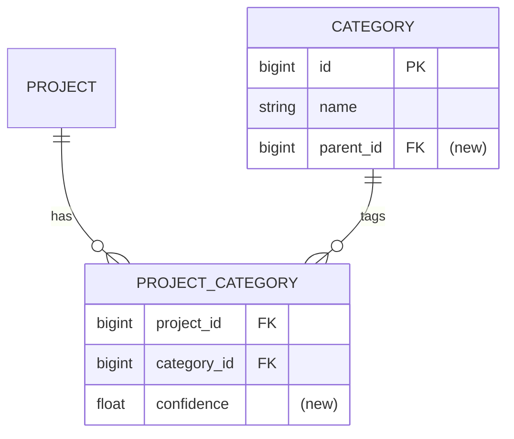

# Spec: [FEATURE NAME]

## 1. Goal
One or two sentences.

## 2. Problem
- What's broken / missing today?
- Who's affected (end users, library authors, developers)?

## 3. User scenarios & acceptance
### Scenario 1 — `<title>` (P1)
- **Given:** `<state>`
- **When:** `<action>`
- **Then:** `<observable outcome>`
- **Independent test:** `<how to verify in isolation>`

### Edge cases
- What happens when `<boundary>`?
- How does the system handle `<error / partial failure>`?

## 4. Functional requirements
*An FR is an **observable contract**: what the system does, seen from outside. Before writing each one, apply the litmus — **could a black-box test or an API consumer detect a violation?** If no, it is a design decision, not a requirement: it belongs in §8, not here.*

*FRs never name an internal mechanism (a table, job, cache, library, query shape). The tell:*
- *✗ "System MUST NOT use a daily snapshot table" — no outside observer can detect this. It's a how. → §8.*
- *✓ "System MUST distinguish "not yet computed" from a score of 0 in the response" — a consumer can read the field and tell. → stays here.*

*`MUST NOT` is for **observable prohibitions** only (e.g. "MUST NOT expose draft projects to unauthenticated callers"), never for internal-mechanism bans.*
- **FR-001:** System MUST …
- **FR-002:** System MUST …
- Mark unknowns inline: `[NEEDS CLARIFICATION: …]`

## 5. Non-functional requirements
*Include only what applies; cut the rest.*
- **Performance:** latency budget, throughput, dataset size
- **External rate limits:** GitHub, Maven Central (repo1 / solrsearch / central.sonatype), OpenAI, S3 — per-IP budgets, klibs egress IPs shared across replicas
- **Concurrency:** scheduling, ShedLock keys, race windows
- **Observability:** new logs / metrics / alerts
- **Security:** auth boundary, token scopes

## 6. Out of scope
Explicit list.

## 7. Klibs.io technical surface
*Mark only lines that apply.*
- **Modules touched:** e.g. `app`, `core/scm-repository`, `integrations/github`
- **Database:** entities and their key fields, relationships, identity strategy, status enums, nullability — the *data model*. Column types, index choice, and exact column naming are migration choices and belong in the plan. Note migration folder (`db/migration/<YYYY>-Q<n>/`), additive-only?, backfill plan?
- **Persistence style:** JPA vs raw JDBC — match the existing pattern in the touched module
- **Search / materialized views:** `project_index` / `package_index` impact
- **External integrations:** APIs called; request volume; retry / backoff
- **Scheduled jobs:** new `@Scheduled`; ShedLock lock names; cadence; idempotency
- **Storage:** S3 prefixes; local cache invalidation
- **Configuration:** new `klibs.*` properties; profile defaults; feature-flag toggle?
- **API surface:** new/changed endpoints; OpenAPI doc; breaking change?
- **Frontend contract:** does `klibs-frontend` need to change?

## 8. Design decisions
*The home for every "how / which mechanism" choice — including the ones the §4 litmus rejected (internal tables, jobs, caches, libraries, query shapes, which-of-two-approaches). Record a decision even when there's only one option on the table — a choice with no stated alternative is still worth writing down so a reviewer can challenge it. Skip the section only if there were genuinely no choices to make.*

### Decision — `<what was decided>`
- **Choice:** `<the mechanism / approach chosen>`
- **Why:** `<rationale>`
- **Rejected:** `<alternative(s) and why not>` — for a genuine multi-way trade-off, list each. Omit only if there was no real alternative.
- **Revisit if:** `<the condition that would flip this>` — optional

## 9. Key entities (only if data model changes)
- **`<EntityName>`:** purpose, key fields, relationships, lifecycle

## 10. Database schema diagram (only if schema changes)
*Mermaid ER diagram of the resulting tables. Mark new tables/columns with `(new)`, removed ones with `(removed)`. Skip if schema is unchanged. Renders natively in GitHub and IntelliJ.*

## 11. Test strategy
- **Unit:** which classes, mocking boundary
- **DB-integration:** `BaseUnitWithDbLayerTest` subclasses; method-level `@Sql` seeds
- **Web / smoke:** `SmokeTestBase` for new endpoints
- *Reviewer-only — manual / staging:* what to verify on `klibs-features` / `klibs-stage`

## 12. Assumptions
- …

## 13. References
- Design docs, related specs, prior art
