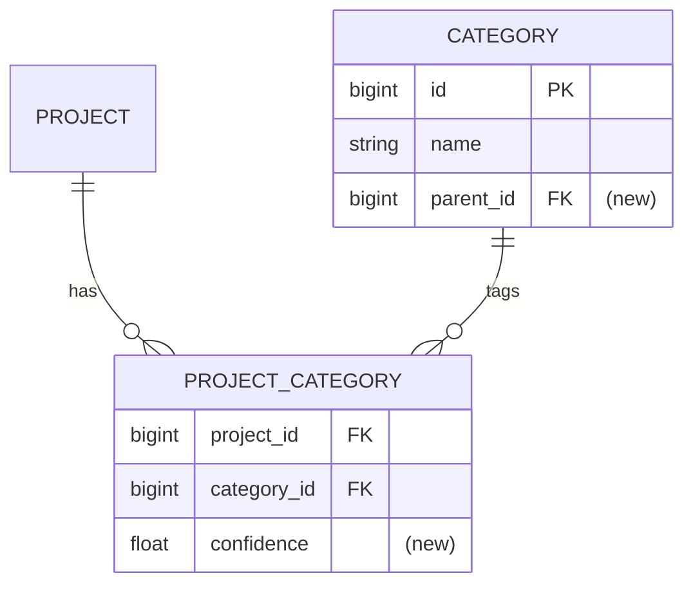

# [FEATURE NAME] — review spec

Review-ready feature spec grouped into collapsible sections for focused discussion.

<strong>Review vocabulary</strong>

 

*Include only terms that may be unfamiliar to a reviewer. Keep definitions short, group related terms, and define prerequisite terms before terms that use them.*

- 

  
<strong>[TOPIC]</strong>

   

  - **[TERM]:** [short definition]
  - **[TERM]:** [short definition]

  

<strong>1. Goal</strong>

 

One or two sentences.

<strong>2. Problem</strong>

 

- What's broken / missing today?
- Who's affected (end users, library authors, developers)?

<strong>3. User Stories (required reading for reviewers)</strong>

 

`P` means priority: `P1` is required, `P2` is important but less central.

<!-- Duplicate, remove, and renumber scenario blocks as needed. -->

- 

  
<strong>3.1 [CORE SCENARIO] (P1)</strong>

   

  - **Given:** `<state>`
  - **When:** `<action>`
  - **Then:** `<observable outcome>`
  - **Independent test:** `<how to verify in isolation>`

  

- 

  
<strong>3.2 [SECONDARY SCENARIO] (P2)</strong>

   

  - **Given:** `<state>`
  - **When:** `<action>`
  - **Then:** `<observable outcome>`
  - **Independent test:** `<how to verify in isolation>`

  

- 

  
<strong>3.N Edge cases — failure behavior reviewers should test</strong>

   

  - What happens when `<boundary>`?
  - How does the system handle `<error / partial failure>`?

  

<strong>4. Functional Contract (required reading for reviewers)</strong>

 

*An FR is an **observable contract**: what the system does, seen from outside. Before writing each one, apply the litmus — **could a black-box test or an API consumer detect a violation?** If no, it is a design decision, not a requirement: it belongs in §8, not here.*

*FRs never name an internal mechanism (a table, job, cache, library, query shape). The tell:*
- *✗ "System MUST NOT use a daily snapshot table" — no outside observer can detect this. It's a how. → §8.*
- *✓ "System MUST distinguish "not yet computed" from a score of 0 in the response" — a consumer can read the field and tell. → stays here.*

*`MUST NOT` is for **observable prohibitions** only (e.g. "MUST NOT expose draft projects to unauthenticated callers"), never for internal-mechanism bans.*

<!-- Group related requirements so reviewers can discuss one behavior at a time. Duplicate and renumber as needed. -->

- 

  
<strong>4.1 [BEHAVIOR GROUP] — FR-001 to FR-00N</strong>

   

  - **FR-001:** System MUST …
  - **FR-002:** System MUST …
  - Mark unknowns inline: `[NEEDS CLARIFICATION: …]`

  

<strong>5. Quality and Security (required reading for reviewers)</strong>

 

*Include only what applies; cut the rest.*

- 

  
<strong>5.1 Performance and external limits</strong>

   

  - **Performance:** latency budget, throughput, dataset size
  - **External rate limits:** GitHub, Maven Central (repo1 / solrsearch / central.sonatype), OpenAI, S3 — per-IP budgets, klibs egress IPs shared across replicas

  

- 

  
<strong>5.2 Concurrency and consistency</strong>

   

  - **Concurrency:** scheduling, ShedLock keys, race windows
  - **Consistency:** atomic operations, partial-failure behavior, retry safety

  

- 

  
<strong>5.3 Observability</strong>

   

  - **Observability:** new logs / metrics / alerts

  

- 

  
<strong>5.4 Security and runtime behavior</strong>

   

  - **Security:** auth boundary, token scopes
  - **Runtime behavior:** timeouts, failure isolation, sensitive-data handling

  

<strong>6. Out of Scope</strong>

 

Explicit list.

<strong>7. Technical Surface (required reading for reviewers)</strong>

 

*Mark only lines and subsections that apply.*

- 

  
<strong>7.1 Backend modules — modules touched</strong>

   

  - **Modules touched:** e.g. `app`, `core/scm-repository`, `integrations/github`

  

- 

  
<strong>7.2 Persistence and migration — database and repository style</strong>

   

  - **Database:** entities and their key fields, relationships, identity strategy, status enums, nullability — the *data model*. Column types, index choice, and exact column naming are migration choices and belong in the plan. Note migration folder (`db/migration/<YYYY>-Q<n>/`), additive-only?, backfill plan?
  - **Persistence style:** JPA vs raw JDBC — match the existing pattern in the touched module
  - **Search / materialized views:** `project_index` / `package_index` impact

  

- 

  
<strong>7.3 External integrations and background work</strong>

   

  - **External integrations:** APIs called; request volume; retry / backoff
  - **Scheduled jobs:** new `@Scheduled`; ShedLock lock names; cadence; idempotency
  - **Storage:** S3 prefixes; local cache invalidation

  

- 

  
<strong>7.4 Configuration namespace</strong>

   

  - **Configuration:** new `klibs.*` properties; profile defaults; feature-flag toggle?

  

- 

  
<strong>7.5 API and frontend contract</strong>

   

  - **API surface:** new/changed endpoints; OpenAPI doc; breaking change?
  - **Frontend contract:** does `klibs-frontend` need to change?

  

<strong>8. Design Decisions (required reading for reviewers)</strong>

 

*The home for every "how / which mechanism" choice — including the ones the §4 litmus rejected (internal tables, jobs, caches, libraries, query shapes, which-of-two-approaches). Record a decision even when there's only one option on the table — a choice with no stated alternative is still worth writing down so a reviewer can challenge it. Skip the section only if there were genuinely no choices to make.*

<!-- Duplicate and renumber decision blocks as needed. -->

- 

  
<strong>8.1 [DECISION TITLE] — [short scope]</strong>

   

  - **Choice:** `<the mechanism / approach chosen>`
  - **Why:** `<rationale>`
  - **Rejected:** `<alternative(s) and why not>` — for a genuine multi-way trade-off, list each. Omit only if there was no real alternative.
  - **Revisit if:** `<the condition that would flip this>` — optional
  - **Needs agreement:** `<question and section 14 reference>` — optional

  

<strong>9. Key Entities (required reading for reviewers; only if data model changes)</strong>

 

<!-- Duplicate and renumber entity blocks as needed. -->

- 

  
<strong>9.1 [EntityName] — fields and lifecycle</strong>

   

  - **Purpose:** `<why this entity exists>`
  - **Key fields:** `<identity and behaviorally important fields>`
  - **Relationships:** `<references and ownership>`
  - **Lifecycle:** `<creation, updates, expiry, or deletion>`

  

<strong>10. Data Model (only if schema changes)</strong>

 

*Mermaid ER diagram of the resulting tables. Mark new tables/columns with `(new)`, removed ones with `(removed)`. Skip if schema is unchanged. Renders natively in GitHub and IntelliJ.*

```mermaid
erDiagram
    PROJECT ||--o{ PROJECT_CATEGORY : has
    CATEGORY ||--o{ PROJECT_CATEGORY : tags
    CATEGORY {
        bigint id PK
        string name
        bigint parent_id FK "(new)"
    }
    PROJECT_CATEGORY {
        bigint project_id FK
        bigint category_id FK
        float confidence "(new)"
    }
```

<strong>11. Test Strategy</strong>

 

- 

  
<strong>11.1 Unit tests — isolated behavior</strong>

   

  - **Unit:** which classes, mocking boundary

  

- 

  
<strong>11.2 DB integration tests — persistence and transactions</strong>

   

  - **DB-integration:** `BaseUnitWithDbLayerTest` subclasses; method-level `@Sql` seeds

  

- 

  
<strong>11.3 Web and smoke tests — API behavior</strong>

   

  - **Web / smoke:** `SmokeTestBase` for new endpoints

  

- 

  
<strong>11.4 Compatibility tests — unchanged behavior</strong>

   

  - Existing behavior that must remain unchanged

  

- 

  
<strong>11.5 Manual staging checks — production-like flow</strong>

   

  - *Reviewer-only — manual / staging:* what to verify on `klibs-features` / `klibs-stage`

  

<strong>12. Assumptions</strong>

 

- …

<strong>13. References</strong>

 

- Design docs, related specs, prior art

<strong>14. Needs Agreement (required reading for reviewers)</strong>

 

*Include only unresolved decisions that require reviewer agreement. Remove an item after the decision is reflected in the relevant contract and design sections.*

<!-- Duplicate and renumber agreement blocks as needed. -->

- 

  
<strong>14.1 [DECISION TITLE]</strong>

   

  - **Question:** [what reviewers need to decide]
  - **Current contract:** [behavior currently specified elsewhere]
  - **Options:** [real alternatives]
  - **Compatibility:** [behavior that must remain unchanged]
  - **If changed:** [sections, contracts, diagrams, or tests that must be updated together]

  

