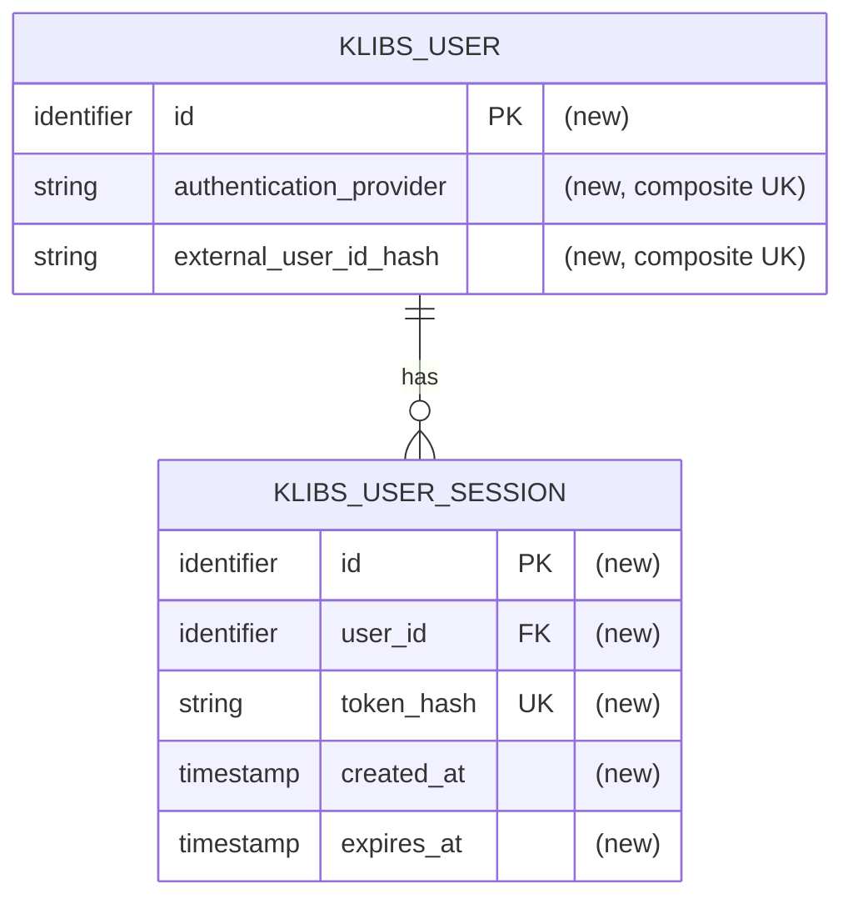

# JetBrains Hub authentication — review spec

Review-ready authentication spec grouped into collapsible sections for focused discussion.

<strong>Review vocabulary</strong>

 

- 

  
<strong>HTTP and API basics</strong>

   

  - **Shared backend data/changes:** data or changes shared beyond the current page, such as DB records, sessions, queued
    jobs, or external service calls.
  - **Endpoint:** backend API method and path, for example `GET /auth/current-user`.
  - **Public endpoint:** endpoint that works without login.
  - **User-only endpoint:** endpoint that needs a signed-in browser user.
  - **Public request:** request to a public endpoint.
  - **Redirect:** HTTP response that tells the browser to open another URL.
  - **Callback:** backend endpoint that the browser opens after Hub finishes login.

  

- 

  
<strong>Sessions and cookies</strong>

   

  - **Basic credentials:** username and password sent in the `Authorization: Basic ...` request header.
  - **Basic auth:** existing operator/admin login using Basic credentials.
  - **Klibs session:** local browser login created after successful Hub login.
  - **Session token:** random secret value created by the backend for a klibs session.
  - **Cookie:** value stored by the browser and automatically sent to matching backend endpoints.
  - **Session cookie:** cookie that carries the session token.
  - **Login attempt:** short-lived data for one browser login flow.
  - **Login cookie:** short-lived cookie for one login attempt.
  - **Cookie flags:** cookie settings: `HttpOnly` (boolean), `Secure` (boolean), `SameSite` (Strict/Lax/None), `Path` (URL
    path), `Max-Age` (duration).
  - **TTL:** time-to-live; how long a temporary value works.

  

- 

  
<strong>OAuth and signed values</strong>

   

  - **Nonce:** random one-time value that makes a login attempt unique.
  - **Signature:** value attached to signed data to prove it was not changed.
  - **HMAC:** function (`message` + `secret key` -> `hash-like value` (`signature`)).
  - **Bearer credential:** secret value that works for whoever has it.
  - **Access token:** short-lived secret value issued by Hub and used by the backend to call Hub APIs.
  - **OAuth code (authorization code):** short-lived value returned by Hub to the callback. The backend exchanges it for an
    access token.
  - **`code_verifier`:** secret random value kept until the token exchange so the backend can prove the same login attempt.
  - **`code_challenge`:** public value derived from `code_verifier` and sent to Hub before login so Hub can verify
    `code_verifier` later.
  - **PKCE:** OAuth protection where the backend sends `code_challenge` before login and later proves the same login attempt
    using `code_verifier`.
  - **OAuth state:** value sent to Hub during login and returned on callback to connect the callback to the login
    attempt. `OAuth state` and `state` mean the same value in this spec.
  - **Token exchange:** backend-to-Hub call that exchanges OAuth code plus PKCE proof for an access token.

  

- 

  
<strong>Browser security and responses</strong>

   

  - **Relative `returnTo`:** frontend path without domain, used to return the browser to the right page after login. Example:
    `/project/kizitonwose/Calendar`.
  - **Open redirect:** bug where attacker-provided `returnTo=https://evil.example` makes a trusted site redirect users there.
  - **URL decoding:** converting URL-encoded text back into characters, for example `%2F` into `/`.
  - **Origin:** scheme, host, and port of the page that started a browser request. Example: `https://klibs.io`.
  - **Credentialed browser call:** browser API request that includes cookies or other login data.
  - **Trusted frontend origin:** configured frontend origin allowed for credentialed browser calls. Example: `https://klibs.io`.
  - **CORS:** browser rule that controls whether one origin can call another origin's API.
  - **CSRF:** attack where another site tries to make the browser send a logged-in request.
  - **CSRF gate:** Origin check before logged-in write actions.
  - **Idempotent:** safe to repeat; the final result stays the same.
  - **XSS:** attack where injected JavaScript runs inside the site.

  

<strong>1. Goal</strong>

 

Add sign-in through JetBrains Hub for regular klibs.io users.

After sign-in, klibs.io can assign the browser to a stable local `klibs_user`. This is needed for future features where
the site must know which user performed an action, such as likes, subscriptions, and maintainer permissions.

Existing anonymous browsing and Basic-auth operator/admin flows must keep working as before.

<strong>2. Problem</strong>

 

- Without a stable local `klibs_user`, future features cannot reliably know which regular user liked, subscribed to, or
  maintained something.
- That identity must survive browser sessions and JetBrains Hub re-login, otherwise the same person can look like different
  klibs.io users.
- The production frontend and backend run on different origins (`https://klibs.io` and `https://api.klibs.io`), so a vague
  login design can redirect to the wrong site, send cookies incorrectly, or leave CSRF behavior unclear.
- Affected: regular users signing in from the frontend, developers adding user-owned features, and operators relying on the
  existing Basic-auth endpoints.

<strong>3. User Stories (required reading for reviewers)</strong>

 

`P` means priority: `P1` is required, `P2` is important but less central.

- 

  
<strong>3.1 Anonymous public browsing stays public (P1)</strong>

   

  - **Given:** a request to a public klibs.io API endpoint without Basic credentials and without a klibs session cookie.
  - **When:** the backend receives the request.
  - **Then:** the endpoint returns the existing public/anonymous response and does not require regular-user authentication.
  - **Independent test:** call representative public endpoints from the existing public contract without credentials and
    assert they remain accessible.

  

- 

  
<strong>3.2 Existing Basic auth stays separate (P1)</strong>

   

  - **Given:** a prod-only operator/admin endpoint and valid `Authorization: Basic ...` credentials with the required role.
  - **When:** the backend receives the request, with or without a klibs session cookie.
  - **Then:** the request is authenticated as the Basic-auth operator/admin identity, and the klibs session cookie does not
    grant or change operator/admin roles.
  - **Independent test:** call a Basic-protected endpoint with Basic credentials, with a session cookie, and with both; assert
    Basic auth behavior is unchanged and session-only access does not receive admin/operator roles.

  

- 

  
<strong>3.3 New user signs in with JetBrains Hub (P1)</strong>

   

  - **Given:** a browser user on `https://klibs.io` who is not signed in to klibs.io.
  - **When:** the user starts Hub sign-in, completes the Hub login, and Hub redirects back to the backend callback.
  - **Then:** klibs.io creates a stable local user identity, creates a local session, sets a browser session cookie, and
    redirects the browser back to `https://klibs.io` plus the validated relative `returnTo` path.
  - **Independent test:** run the full OAuth flow against a test Hub server and assert the final redirect, session cookie,
    and `/auth/current-user` response.

  

- 

  
<strong>3.4 Returning user is recognized from an existing session (P1)</strong>

   

  - **Given:** a browser has a klibs session cookie whose token matches a non-expired DB session from a previous login.
  - **When:** the browser opens klibs.io or calls `/auth/current-user`.
  - **Then:** the backend returns `authenticated=true` and the same local `userId`.
  - **Independent test:** create a valid session, call `/auth/current-user`, and assert the response contains
    `authenticated=true` plus the expected local `userId`.

  

- 

  
<strong>3.5 Returning user is recognized after Hub re-login (P1)</strong>

   

  - **Given:** a user previously signed in through Hub and later starts a new valid Hub sign-in from the browser.
  - **When:** callback validation passes and Hub returns the same stable Hub user id.
  - **Then:** klibs.io resolves the same local `userId` instead of creating a separate visible user identity.
  - **Independent test:** run two successful login flows against a test Hub server for the same Hub user id and assert
    `/auth/current-user` returns the same local `userId` after both logins.

  

- 

  
<strong>3.6 User-only write request is protected from CSRF (P1)</strong>

   

  - **Given:** a browser sends a klibs session cookie.
  - **When:** a user-only write request is sent with a missing or untrusted `Origin`.
  - **Then:** the backend returns `403` before session lookup, and the requested change is not applied.
  - **Independent test:** call a representative write endpoint with a session cookie but untrusted/missing Origin and assert
    `403` plus no observable action result.

  

- 

  
<strong>3.7 Sign out is idempotent except rejected CSRF (P2)</strong>

   

  - **Given:** a browser calls `POST /auth/sign-out`.
  - **When:** there is no session cookie, or the referenced DB session is already missing/expired.
  - **Then:** without a session cookie, missing/trusted Origin returns `204` without `Set-Cookie` or session lookup; untrusted
    Origin is rejected by CORS with `403` before the endpoint. With a session cookie, `204` applies only after Origin validation.
  - **Independent test:** cover missing, stale, and valid cookies with missing, trusted, and untrusted Origin; assert the status,
    cookie clearing, and session deletion behavior.

  

- 

  
<strong>3.8 Edge cases — failure behavior reviewers should test</strong>

   

  - Callback does not match the current login attempt -> reject it without clearing the login cookie.
  - Callback fails after matching the current login attempt -> OAuth error response and clear the login cookie.
  - `returnTo` is parsed and validated after URL decoding. Absolute URLs, scheme-relative URLs, decoded backslashes, decoded
    control characters, or unparsable values -> fallback to `/`.
  - Session cookie exists but session is expired or missing -> `/auth/current-user` returns `authenticated=false`; user-only
    requests return `401`; an accepted request clears the stale cookie.
  - Session cookie exists and user-only write request has missing/untrusted Origin -> return `403` before HMAC/DB session
    lookup, even if the DB session would be missing or expired.
  - Sign-out with valid session cookie and missing/untrusted Origin -> `403`, cookie is not cleared, and session is not deleted.
  - Sign-out without a session cookie -> missing/trusted Origin returns `204`; untrusted Origin returns CORS `403`; no branch
    sends `Set-Cookie` or accesses the session store.
  - Public endpoint with a valid session cookie -> stays anonymous for this feature. Future public endpoints may define
    separate behavior for signed-in users.
  - Concurrent logins for the same provider and stable external user id -> resolve one local user through the database unique
    constraint and conflict-safe insert.
  - Session creation fails after a new local user was created -> no partial session remains; the local user may remain and a
    later login reuses it.

  

<strong>4. Functional Contract (required reading for reviewers)</strong>

 

- 

  
<strong>4.1 Compatibility requirements — FR-001 to FR-003</strong>

   

  - **FR-001:** Public klibs.io endpoints MUST remain accessible without Basic credentials and without a klibs session
    cookie.
  - **FR-002:** Existing Basic-auth protected endpoints MUST continue to authenticate configured Basic users and roles.
  - **FR-003:** A klibs session cookie MUST NOT grant Basic/admin/operator roles, and new browser session logic MUST NOT
    change Basic-auth users, roles, or access checks.

  

- 

  
<strong>4.2 Hub login requirements — FR-004 to FR-008</strong>

   

  - **FR-004:** Starting Hub sign-in MUST redirect the browser to JetBrains Hub authorization.
  - **FR-005:** The Hub callback MUST validate the login attempt before exchanging the OAuth code. If validation fails, it
    MUST NOT call Hub token/user-info endpoints, MUST NOT create a klibs user/session, and MUST return an OAuth error response.
    A request that does not match the current login attempt MUST NOT clear it.
  - **FR-006:** After matching the current login attempt, the callback MUST clear it when processing finishes, both on success
    and on failure.
  - **FR-007:** Successful Hub login MUST result in a local klibs session cookie and a redirect to the trusted frontend origin
    plus a validated relative `returnTo` path.
  - **FR-008:** The backend MUST NOT redirect a successful login to an arbitrary external origin.

  

- 

  
<strong>4.3 Current-user and session requirements — FR-009 to FR-011</strong>

   

  - **FR-009:** `/auth/current-user` MUST return `authenticated=false` when there is no valid klibs session.
  - **FR-010:** `/auth/current-user` MUST return `authenticated=true` and the local `userId` when there is a valid klibs
    session.
  - **FR-011:** After the CSRF gate, a user-only endpoint MUST return `401` when no valid klibs session is available.

  On `/auth/current-user` and user-only endpoints, a cookie for a missing or expired session MUST NOT authenticate and MUST
  be cleared after applicable CORS/Origin checks. Rejected requests MUST NOT reach session lookup or cookie clearing.

  Important distinction: `/auth/current-user` is an auth-state endpoint, not a user-only action endpoint. Its unauthenticated
  response is `authenticated=false`, not `401`.

  

- 

  
<strong>4.4 Read, write, and CSRF requirements — FR-012 to FR-014</strong>

   

  - **FR-012:** A read request MUST NOT require CSRF Origin validation. It MUST follow the normal public or user-only
    endpoint authentication rules.
  - **FR-013:** A write request with a klibs session cookie and missing or untrusted Origin MUST return `403` before session
    lookup and MUST NOT apply the requested change.
  - **FR-014:** A write request with a klibs session cookie, exact trusted Origin, and a valid session MUST pass
    authentication/CSRF checks and proceed to endpoint-specific authorization and validation.

  Definitions:

  - a **read request** gets data or current login status and must not apply the requested shared backend change;
  - a **write request** creates, updates, deletes, revokes, or otherwise changes shared backend data or triggers a shared
    backend change;
  - opening a page is a read request when the requested result is only page data;
  - logging, metrics, tracing, and cache updates do not turn a request into a write request;
  - CSRF Origin enforcement applies to write requests, including any endpoint classified as changing something through the
    backend even if its HTTP method is unusual.

  

- 

  
<strong>4.5 Sign-out requirements — FR-015 to FR-017</strong>

   

  - **FR-015:** `POST /auth/sign-out` without a klibs session cookie MUST return `204` without `Set-Cookie` or session access
    for missing/trusted Origin. An untrusted Origin MUST be rejected by CORS with `403` before the endpoint.
  - **FR-016:** `POST /auth/sign-out` with a klibs session cookie and missing or untrusted Origin MUST return `403` and MUST
    NOT clear the cookie or delete the session.
  - **FR-017:** `POST /auth/sign-out` with a klibs session cookie and trusted Origin MUST clear the klibs session cookie and
    return `204`; missing or already-expired DB sessions are treated as an idempotent success.

  

- 

  
<strong>4.6 Identity boundary requirements — FR-018 to FR-024</strong>

   

  - **FR-018:** Re-login with the same stable Hub user id MUST resolve to the same local klibs `userId`.
  - **FR-019:** The backend MUST store a provider plus an HMAC-derived external user id hash, never the raw Hub user id.
  - **FR-020:** Identity hashes, session-token hashes, and signed OAuth state MUST use the same configured HMAC secret with
    distinct domain prefixes (`hub-account:`, `session-token:`, and `oauth-state:`).
  - **FR-021:** Automatic HMAC-secret rotation and previous-key lookup are out of scope. Replacing the secret is unsupported:
    it invalidates existing sessions and breaks identity continuity until a separate migration/rotation flow is implemented.
  - **FR-022:** Concurrent successful logins for the same provider and stable external user id MUST resolve one local user.
  - **FR-023:** Browser JavaScript MUST NOT receive the Hub access token.
  - **FR-024:** When authentication is disabled, `GET /auth/current-user` and `POST /auth/sign-out` MUST be absent (`404`),
    existing klibs session cookies MUST NOT authenticate user-only requests, and `/user/**` MUST remain inaccessible.

  

- 

  
<strong>4.7 Response contract — status codes and OAuth failures</strong>

   

  - An **OAuth error response** is a non-cacheable backend HTTP error response, not a success redirect.
  - After the callback matches the current login attempt, it clears the login cookie and does not set a local session cookie.
  - Local callback/login-attempt validation failures return `400`.
  - Hub timeout returns `504`.
  - Unavailable or malformed Hub responses return `502`.
  - Hub OAuth errors such as `invalid_grant` return `400`.

  

<strong>5. Quality and Security (required reading for reviewers)</strong>

 

- 

  
<strong>5.1 Credential storage — what must never be persisted</strong>

   

  - Hub access tokens, raw Hub user ids, and raw local session tokens must not be persisted in the klibs DB.
  - A DB leak alone must not let an attacker log in or identify the real Hub user.

  

- 

  
<strong>5.2 Cookie and login integrity — flags and callback binding</strong>

   

  - Session cookies and login cookies must be `HttpOnly` (not readable by browser JavaScript), `Secure` in production (sent
    only over HTTPS), and `SameSite=Lax` (not sent with most requests made from inside another site, but sent when the browser
    follows a link or redirect to this site).
  - The production session cookie name must use the `__Host-` prefix, `Path=/`, and no `Domain`. Local development may disable
    `Secure` and use a non-prefixed name so HTTP localhost works.
  - OAuth state (state) must include a per-login random nonce and expiry.
  - Callback processing must validate signed OAuth state (state), nonce-bearing login cookie, PKCE `code_verifier`, and
    validated `returnTo` as one login attempt.

  

- 

  
<strong>5.3 CSRF and caching — Origin checks and non-cacheable auth responses</strong>

   

  - Cookie-authenticated write requests require exact trusted Origin matching.
  - Missing Origin is untrusted.
  - CORS is evaluated before auth endpoints and may reject an untrusted Origin before endpoint behavior is evaluated.
  - Auth responses that carry identity or cookie state must be non-cacheable by shared/public caches (CDNs, proxies, and
    other caches shared by multiple users must not store or reuse these responses).

  

- 

  
<strong>5.4 Runtime behavior — transactions, timeouts, and safe logs</strong>

   

  - User resolution/creation and session creation are separate transactional operations. If session creation fails, no
    partial session may remain; a newly created local user may remain and must be reused by a later login.
  - Each HTTP call to Hub must stop when its timeout is reached, so a stalled Hub cannot keep a backend request running
    indefinitely.
  - Default timeout budget: connect <= 2 seconds, each Hub HTTP call <= 5 seconds, and the combined callback Hub-call budget
    <= 10 seconds. These confirmed defaults must be configurable (section 14.2).
  - Authentication failures may log only a safe error category, such as invalid OAuth state (state) or Hub timeout. Logs
    must not contain raw tokens, authorization codes, Hub user ids, or session cookies.

  

- 

  
<strong>5.5 Configuration boundary — feature flag and frontend/API origins</strong>

   

  - Authentication must be feature-flagged. When it is disabled, `GET /auth/current-user` and `POST /auth/sign-out` are
    absent and return `404`; other `/auth/**` requests follow the existing fallback security policy. Existing klibs session
    cookies no longer authenticate users, and `/user/**` is denied. Anonymous user-only requests return `401`; Basic
    credentials do not grant the regular-user authority. Public endpoints and existing Basic-protected endpoints continue
    to work unchanged.
  - Every endpoint that accepts the klibs session cookie for credentialed API calls must allow credentialed browser calls
    only from the configured trusted frontend origin for that deployment.
  - Browser requests with a klibs session cookie must be allowed only from that exact origin, never from every origin (`*`).
  - Hub callback navigation is validated by OAuth state (state), login cookie, and PKCE, not by a trusted-Origin CSRF check.

  

<strong>6. Out of Scope</strong>

 

- Frontend UI design for sign-in/sign-out controls.
- GitHub-native login as a separate identity provider.
- Storing or exposing GitHub native ids.
- Replacing existing Basic auth.
- Defining maintainer permissions, likes, subscriptions, or other user-owned domain actions.
- A scheduled expired-session cleanup job. Expired sessions are deleted when encountered.
- Automatic HMAC-secret rotation, previous-key lookup, and automatic identity migration.

<strong>7. Technical Surface (required reading for reviewers)</strong>

 

- 

  
<strong>7.1 Backend modules — modules touched</strong>

   

  - `app` — auth endpoints, security integration, Hub OAuth client wiring, cookie/Origin handling, and configuration.
  - `core/user` (new module) — local user/session entities, repositories, and services.
  - `frontend` — only if sign-in/sign-out UI or frontend auth calls are added; the backend contract itself is independent.

  

- 

  
<strong>7.2 Persistence and migration — database migration and repository style</strong>

   

  - New local user and session tables.
  - Add new Liquibase migrations for the authentication tables and constraints under
    `app/src/main/resources/db/migration/<YYYY>-Q<n>/`. Do not change migrations that may have already run.
  - Include the migration in `db.changelog-master.yml`.
  - Store users and sessions using the database access pattern already used by the project. Add database tests for
    constraints, conflict-safe inserts, and rollback within each transactional operation.
  - Project and package search must continue working unchanged. Authentication tables are not part of the search data.

  

- 

  
<strong>7.3 External integrations — Hub calls and session cleanup</strong>

   

  - Browser authorization through the JetBrains Hub authorization endpoint.
  - Server-to-server token exchange with PKCE.
  - JetBrains Hub current-user/user-info endpoint.
  - Expired sessions are deleted when encountered. No scheduled cleanup job is part of this feature.

  

- 

  
<strong>7.4 Configuration namespace — `klibs.auth` settings</strong>

   

  - Extend existing `klibs.auth` namespace.
  - Keep existing `klibs.auth.users` for Basic auth.
  - Keep shared authentication settings under `klibs.auth.*`: `enabled`, `hmac-secret`, and `trusted-frontend-origin`.
  - Keep local-session settings under `klibs.auth.session.*`: idle TTL, refresh interval, absolute TTL, cookie name, and
    `Secure` flag. Keep Hub-specific settings under `klibs.auth.hub.*`, including connection, OAuth-state, and login-cookie
    settings.
  - Configure one Base64-encoded HMAC secret containing at least 32 decoded bytes. The same secret is used with domain
    separation for identity hashes, session-token hashes, and OAuth-state signatures.
  - Secret values must come from the deployment environment or secret storage and must not be committed to the repository.
    Automatic rotation and previous-secret lookup are not implemented.

  

- 

  
<strong>7.5 API and frontend contract — endpoints and production origins</strong>

   

  New endpoints:

  - `GET /auth/hub/sign-in`
  - `GET /auth/hub/callback`
  - `GET /auth/current-user`
  - `POST /auth/sign-out`

  Compatibility rules:

  - No breaking changes to existing public or Basic-auth endpoints.
  - Production frontend origin is `https://klibs.io`.
  - Production backend origin is `https://api.klibs.io`.
  - Successful login returns to frontend origin plus validated relative `returnTo`.

  

<strong>8. Design Decisions (required reading for reviewers)</strong>

 

- 

  
<strong>8.1 Backend-owned OAuth — flow and local session model</strong>

   

  - **Choice:** Use backend-owned OAuth code flow with PKCE. The backend exchanges the code with Hub, reads the Hub user id,
    and issues a local HttpOnly klibs session cookie.
  - **Why:** Browser JavaScript never receives the Hub access token, and klibs.io can use one local session model for future
    user-owned actions.
  - **Rejected:** Pure frontend PKCE where the browser receives and stores the Hub access token. It is valid OAuth for public
    browser clients, but it exposes the Hub access token to JavaScript and XSS exfiltration.
  - **Revisit if:** klibs.io deliberately chooses a public-browser-client OAuth architecture and accepts the token exposure
    trade-off.

  

- 

  
<strong>8.2 Login attempt integrity — OAuth state, PKCE, and validated returnTo</strong>

   

  - **Choice:** Store a short-lived login attempt in an HttpOnly cookie. It binds signed OAuth state (state), PKCE
    `code_verifier`, and validated relative `returnTo`.
  - **OAuth state (state) contents:** expiration, validated relative `returnTo`, random nonce, and HMAC signature.
  - **Login cookie role:** the cookie stores/binds OAuth state (state) together with the PKCE `code_verifier`.
  - **PKCE role:** PKCE sends `code_challenge = BASE64URL(SHA256(code_verifier))` to Hub first and reveals `code_verifier`
    only during backend-to-Hub token exchange.
  - **Why:** Signed state protects callback integrity; cookie comparison binds callback to the browser that started login;
    PKCE binds the authorization code to this login attempt; validated `returnTo` prevents open redirect.
  - **Rejected:** Putting the PKCE `code_verifier` in URL-visible OAuth state (state); accepting callback OAuth state
    without a browser-bound login cookie.
  - **Revisit if:** a backend login-attempt store replaces the cookie.

  

- 

  
<strong>8.3 Frontend redirect — trusted frontend origin plus relative returnTo</strong>

   

  - **Choice:** Treat `returnTo` as a relative frontend path and compose the final success redirect as
    `trustedFrontendOrigin + validatedRelativeReturnTo`.
  - **Why:** Production frontend and backend are different origins. Redirecting to a relative path on the backend origin would
    send users to `api.klibs.io/...`; accepting absolute URLs would create open-redirect risk.
  - **Rejected:** Accepting arbitrary absolute `returnTo`; redirecting to callback/backend origin by default.

  

- 

  
<strong>8.4 Pseudonymous Hub identity — HMAC instead of raw Hub user id</strong>

   

  - **Choice:** Store `authentication_provider` plus
    `external_user_id_hash = HMAC(sharedHmacSecret, "hub-account:" + stableHubUserId)`, not the raw Hub user id.
  - **Concurrency:** The provider/hash pair is unique. Conflict-safe insert followed by lookup makes concurrent logins for
    the same Hub account resolve one local user.
  - **Secret lifecycle:** Automatic rotation and previous-key lookup are not implemented. Replacing the secret is unsupported:
    it invalidates existing sessions and breaks identity continuity until a separate migration/rotation flow is implemented.
  - **Why:** A DB leak alone should not reveal the real Hub user, while provider plus a stable derived id supports future
    identity providers without changing the local user model.
  - **Rejected:** Storing raw external user ids; using a plain SHA hash without a secret; automatic multi-key rotation in the
    first version.

  

- 

  
<strong>8.5 Session token HMAC — random bearer token, hashed DB value</strong>

   

  - **Choice:** Generate a 32-byte random session token for the browser cookie and store only
    `HMAC(sharedHmacSecret, "session-token:" + token)` in DB.
  - **Domain separation:** Identity hashes, session-token hashes, and OAuth-state signatures use the same secret but distinct
    prefixes, so values from one purpose cannot be reused as inputs for another.
  - **Why:** The browser can authenticate with the cookie, while DB leak alone does not reveal usable session credentials.
  - **Rejected:** Persisting raw session tokens; using Hub access tokens as klibs sessions.

  

- 

  
<strong>8.6 Basic auth separation — operator/admin identity remains separate</strong>

   

  - **Choice:** Preserve existing Basic-auth users and roles as a separate authentication path from klibs user sessions.
  - **Why:** Existing admin/operator endpoints depend on Basic roles, and a regular-user session must not become an admin
    identity. New browser session logic must not change Basic-auth users, roles, or access checks.
  - **Rejected:** Replacing Basic auth with Hub auth in this feature; mapping any klibs session to admin/operator roles.

  

- 

  
<strong>8.7 Origin check — exact trusted Origin for cookie-authenticated writes</strong>

   

  - **Choice:** For cookie-authenticated write requests, require exact trusted Origin. Missing Origin is untrusted.
  - **Why:** Local session cookies are bearer credentials sent automatically by the browser, so write actions need CSRF
    protection.
  - **Rejected:** Wildcard/suffix Origin matching; relying only on SameSite=Lax.
  - **Choice:** This is the complete CSRF policy for this feature; no separate CSRF token is required (section 14.4).

  

- 

  
<strong>8.8 Session expiry cleanup — cleanup job is not the authentication boundary</strong>

   

  - **Choice:** A session is valid only while its idle and absolute lifetimes have not expired. Idle expiry may be refreshed
    after the configured interval, but never beyond the absolute lifetime. Expired sessions are deleted when encountered.
  - **Why:** Correctness should not depend on scheduler timing or allow indefinite session extension.
  - **Rejected:** Treating cleanup as the mechanism that makes sessions invalid.

  

<strong>9. Key Entities (required reading for reviewers)</strong>

 

- 

  
<strong>9.1 KlibsUser — fields and lifecycle</strong>

   

  - **Purpose:** local pseudonymous regular-user identity.
  - **Key fields:** local id, authentication provider, external user id hash.
  - **Relationships:** one user has many sessions; future user-owned data should reference this local id.
  - **Lifecycle:** created on first successful login for a provider/external-id pair and reused on later logins for the same
    pair. Secret replacement is unsupported until a separate migration/rotation flow is implemented.

  

- 

  
<strong>9.2 KlibsUserSession — fields and lifecycle</strong>

   

  - **Purpose:** local browser session for a `KlibsUser`.
  - **Key fields:** local id, user id, session token hash, creation timestamp, idle-expiry timestamp.
  - **Relationships:** belongs to one `KlibsUser`.
  - **Lifecycle:** created on successful login; refreshed while active; deleted on sign-out or when encountered after expiry.

  

- 

  
<strong>9.3 Login cookie — short-lived OAuth attempt</strong>

   

  - **Purpose:** keep one browser login attempt available between sign-in start and Hub callback.
  - **Contains:** signed OAuth state and PKCE `code_verifier`.
  - **Does not contain:** Hub access token, raw Hub user id, or local session token.
  - **Lifecycle:** created when Hub sign-in starts; cleared after a matching callback finishes on success or failure.

  

- 

  
<strong>9.4 OAuth state — signed callback data</strong>

   

  - **Purpose:** bind Hub callback data to the login attempt that started in this browser.
  - **Contains:** expiration timestamp, validated relative `returnTo`, random nonce, and HMAC signature.
  - **Lifecycle:** created when Hub sign-in starts; sent to Hub; returned by Hub callback; validated by the backend.

  

- 

  
<strong>9.5 Session cookie — local browser session</strong>

   

  - **Purpose:** authenticate later browser requests as a local klibs session.
  - **Contains:** raw random local session token.
  - **DB mapping:** DB stores only `HMAC(sharedHmacSecret, "session-token:" + sessionToken)`.
  - **Does not contain:** Hub access token or raw Hub user id.
  - **Lifecycle:** created after successful login; cleared on trusted sign-out or when `/auth/current-user` or a user-only
    request finds the matching DB session missing/expired; refreshed together with the server-side idle expiry.

  

<strong>10. Data Model</strong>

 

Notes:

- (`authentication_provider`, `external_user_id_hash`) is unique. For Hub, the hash is derived from the stable Hub user id
  with the shared HMAC secret and the `hub-account:` domain prefix.
- `token_hash` is derived from the random browser session token with the same secret and the `session-token:` domain prefix.
- `created_at` anchors the absolute lifetime; `expires_at` is the refreshable idle expiry.
- The DB stores no raw Hub user id, no raw Hub access token, and no raw browser session token.

<strong>11. Test Strategy</strong>

 

- 

  
<strong>11.1 Unit tests — pure validation and cryptography helpers</strong>

   

  - OAuth state (state) encoding and validation.
  - PKCE value generation.
  - `returnTo` validation.
  - HMAC helpers.
  - Origin matching.

  

- 

  
<strong>11.2 DB integration tests — persistence, constraints, and transactions</strong>

   

  - User/session repositories and service behavior.
  - Unique provider/external-id and session-token constraints.
  - Session expiry lookup.
  - Rollback within user and session transactional operations.
  - A session failure may leave a reusable local user but no partial session.
  - Concurrent logins for the same provider/external-id pair result in one local user.
  - Repeated token-hash collisions are retried and eventually fail without creating an ambiguous session.

  

- 

  
<strong>11.3 Web and smoke tests — endpoints, test Hub server, cookies, CORS/Origin</strong>

   

  - `/auth/hub/sign-in`.
  - `/auth/hub/callback`.
  - `/auth/current-user`.
  - `/auth/sign-out`.
  - Test Hub server success and failure.
  - CORS/Origin behavior.
  - Cookies set/cleared with expected flags, including no-cookie sign-out, stale sessions, and unmatched callbacks.

  

- 

  
<strong>11.4 Compatibility tests — public API and Basic auth are unchanged</strong>

   

  - Existing public endpoints remain public.
  - Existing Basic-auth endpoints keep role behavior.
  - Session cookie alone does not grant Basic roles.

  

- 

  
<strong>11.5 Manual staging checks — production-like flow</strong>

   

  - Run a full sign-in against configured Hub.
  - Verify redirect lands on `klibs.io`, not `api.klibs.io`.
  - Verify cookies are Secure, HttpOnly, and SameSite=Lax.
  - Verify sign-out clears the session.

  

<strong>12. Assumptions (required reading for reviewers)</strong>

 

- JetBrains Hub returns a stable user id for the authenticated Hub account.
- Production login callback is hosted on the backend origin, and the final successful redirect must return to the frontend
  origin.
- `returnTo` only needs to support relative frontend paths.
- Existing Basic-auth users under `klibs.auth.users` remain the operator/admin auth source.
- A new `core/user` module is acceptable for local user/session domain code.
- The exact OAuth state/login-cookie TTL and Hub scopes are deferred to Hub implementation. Local-session TTLs and the
  production session-cookie requirements are confirmed in section 14.

<strong>13. References</strong>

 

- Authentication UML artifact:
  - `01 - Authentication Big Picture`
  - `02 - Login With Hub`
  - `03 - What The OAuth Values Mean`
  - `04 - Requests After Login`
  - `05 - Logout And Storage Rules`
- Spec-driven workflow template from JetBrains/klibs-io PR #307.
- Existing project architecture on clean `master`: Spring Boot `app`, feature-oriented `core/*` modules, PostgreSQL with
  Liquibase migrations, Kotlin Toolchain `project.yaml`/`module.yaml`, existing `klibs.auth.users` Basic auth.

<strong>14. Confirmed Decisions and Deferred Hub Parameter (required reading for reviewers)</strong>

 

- 

  
<strong>14.1 Cookie clearing from untrusted requests</strong>

   

  - **Decision:** no-cookie sign-out does not send `Set-Cookie`; CORS may reject an untrusted Origin before the endpoint.
  - **Decision:** `/auth/current-user` and accepted user-only requests clear stale session cookies; rejected requests do not.
  - **Decision:** a Hub callback clears the login cookie only after matching the current login attempt.

  

- 

  
<strong>14.2 Hub timeout and authentication TTL values</strong>

   

  - **Decision:** Hub timeout defaults are connect <= 2 seconds, each call <= 5 seconds, and callback Hub calls <= 10 seconds
    in total.
  - **Decision:** local sessions use 30-day idle TTL, 1-day refresh interval, and 180-day absolute TTL; the cookie follows the
    remaining server-side TTL.
  - **Deferred to Hub implementation:** the exact short OAuth state/login-cookie TTL.

  

- 

  
<strong>14.3 Expired session cleanup</strong>

   

  - **Decision:** an expired session never authenticates and is deleted when encountered. No scheduled cleanup job is required.

  

- 

  
<strong>14.4 CSRF protection strategy</strong>

   

  - **Decision:** exact trusted-Origin validation is the complete CSRF policy for this feature; no separate CSRF token is
    required. It does not apply to public requests without a session cookie, Basic auth, or the Hub callback navigation.

  

