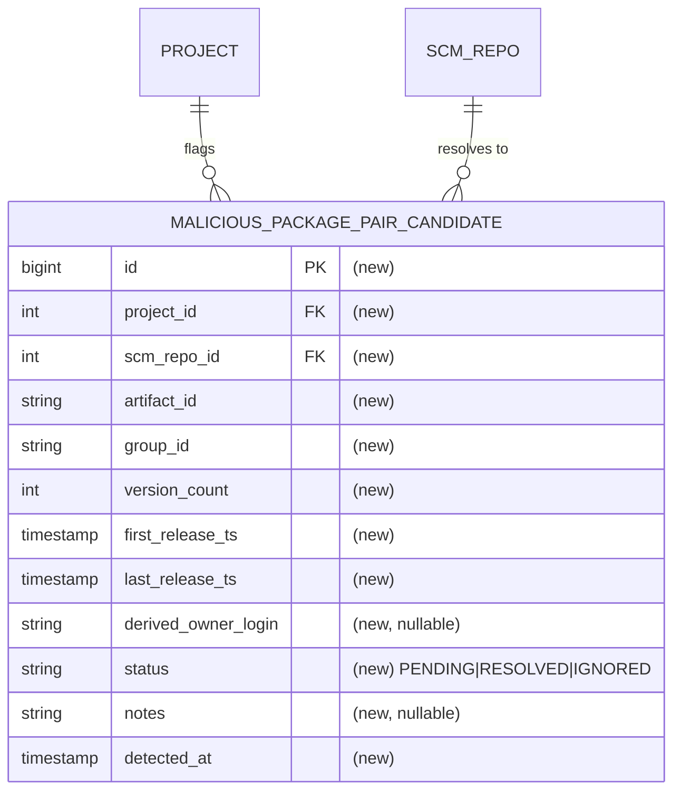

# Spec: Malicious package-pair candidate collection

## 1. Goal
Detect "malicious package pairs" — the same `artifactId` published under more than one `groupId` within a single indexed project — and persist every detected entry into a durable, reviewable table enriched with dormancy and ownership signals plus a review lifecycle (`status` + reviewer `notes`), populated by a **scheduled job that periodically recomputes the conflict set from the catalogue**, so a human can triage cases over time. This task owns both detection and collection; it makes **no ban/verdict decision**.

## 2. Problem
- There is no durable record of malicious package pairs. The detection has only ever run as a throwaway SQL view on an unmerged spike branch; nothing that ships today computes or stores these cases.
- A live view holds **no reviewer state**: a case silently appears or disappears as the catalogue changes, with no way to record "a human already looked at this."
- The signals a reviewer needs aren't gathered per conflicting entry: release timestamps (dormancy) live scattered across per-version `package` rows. Nothing collects them per entry, alongside a `groupId`-derived owner login, into one triage-ready record.
- **Who's affected:** klibs.io maintainers / security reviewers triaging potential impersonation or name-squat republishes; and, downstream, the future automated ban pipeline that will consume reviewed cases.

## 3. User scenarios & acceptance

### Scenario 1 — Malicious pairs are detected and collected (P1)
- **Given:** the catalogue contains a project where one `artifactId` is published under two distinct `groupId`s.
- **When:** the collection job runs.
- **Then:** one row per `(project_id, artifact_id, group_id)` entry exists in the candidate table, each with `status = PENDING` and a `detected_at` timestamp.
- **Independent test:** DB-integration — seed `package` rows forming a conflicting pair, run the recompute, assert the expected entry rows exist with `PENDING`.

### Scenario 2 — Reviewer decisions survive re-runs (P1)
- **Given:** a reviewer has set a candidate row to `RESOLVED` (or `IGNORED`).
- **When:** the collection job runs again while the pair still conflicts.
- **Then:** the row's `status` **and reviewer `notes`** are unchanged (status not reset to `PENDING`) and no duplicate row is created; only the signal columns may be refreshed.
- **Independent test:** DB-integration — mark a row `RESOLVED`, re-run the recompute, assert status still `RESOLVED` and exactly one row for that group key.

### Scenario 3 — Owner is derived only for GitHub-account coordinates (P1)
- **Given:** two entries, one under `io.github.alice`, one under `com.example`.
- **When:** collected.
- **Then:** the `io.github.alice` entry row has `derived_owner_login = alice`; the `com.example` entry row has `derived_owner_login = NULL`.
- **Independent test:** DB-integration asserting both rows' `derived_owner_login`.

### Edge cases
- Same `artifactId` under **3+ groupIds** → 3+ entry rows sharing the `(project_id, artifact_id)` group key.
- Every candidate entry has a resolved repo: a candidate requires `project_id IS NOT NULL` (§8), and a `project` is only ever created from a resolved GitHub repo, so `project.scm_repo_id` is always present — `scm_repo_id` on the candidate is therefore non-null. (Each entry also has ≥1 release, since it derives from `package` rows whose `release_ts` is NOT NULL, so release timestamps are always present.)
- A pair that **no longer conflicts** on a later run — possible only when an entry's packages are removed. Indexing never deletes packages (it only inserts new versions or updates existing rows) and a package's `group_id` never changes; the only deletion path is the admin ban flow (`DELETE FROM package`). The candidate rows are **retained as-is** with their last `status`/`notes`, as an audit record; the upsert never deletes rows that drop out of detection.
- The two entries of a pair are indexed at **different times** → the conflict is recorded on the **first scheduled recompute after both entries exist** in `package`. No backfill is needed — the first run of the job seeds every conflict already present in the catalogue.

## 4. Functional requirements
- **FR-001:** For every `(project_id, artifact_id)` where that `artifactId` is published under more than one distinct `groupId` within the project, the system MUST record one row per `(project_id, artifact_id, group_id)` entry.
- **FR-002:** Each row MUST expose `version_count`, `first_release_ts`, and `last_release_ts` for that entry.
- **FR-003:** Each row MUST expose `project_id` (the group key together with `artifact_id`) and the entry project's `scm_repo_id`.
- **FR-004:** For **every** `(project_id, artifact_id)` conflict, the system MUST record all of its entries — it MUST NOT pre-filter candidates by any signal (dormancy, owner mismatch, dependent count, etc.). Triage is manual.
- **FR-005:** Each row MUST expose `derived_owner_login` equal to the **lower-cased** owner segment of an `io.github.<owner>` or `com.github.<owner>` coordinate, and it MUST be `NULL` when the `group_id` is not of that form.
- **FR-006:** The system MUST provide a nullable free-text `notes` field for reviewers to record *why* a row was moved to `RESOLVED`/`IGNORED`. The collection job populates the table but MUST NOT write or overwrite `notes`.
- **FR-007:** A newly detected entry MUST be recorded with `status = PENDING` and a `detected_at` timestamp.
- **FR-008:** `status` MUST be one of `PENDING`, `RESOLVED`, `IGNORED`.
- **FR-009:** A reviewer-set `status` **and `notes`** MUST persist across subsequent collection runs — a re-run MUST NOT revert a `RESOLVED`/`IGNORED` row to `PENDING` or clear its `notes`.
- **FR-010:** A collection run MUST NOT create duplicate rows for the same `(project_id, artifact_id, group_id)` entry.
- **FR-011:** When a previously recorded entry is no longer detected as conflicting, the system MUST retain its existing row unchanged — it MUST NOT delete rows that drop out of detection.

## 5. Non-functional requirements
- **Performance / dataset size:** the *output* is small — a spike run against a prod copy produced ~1,000 conflicting entry rows across ~200 projects. Detection is a **single set-based aggregation** over `package` (`GROUP BY project_id, artifact_id HAVING count(DISTINCT group_id) > 1`, `project_id IS NOT NULL`) run on a schedule; PostgreSQL handles it cheaply (one sequential scan + hash aggregate) even at hundreds of thousands to millions of rows — seconds of work. The **indexing pipeline is not touched**: no per-package cost is added to the hot path.
- **External rate limits:** **none.** Detection and every stored column come from existing local tables (`package`, `project`, `scm_repo`). `derived_owner_login` is a pure string parse of `group_id`. No GitHub / Maven Central / OpenAI calls.
- **Concurrency:** detection is a standalone scheduled job under its own `@SchedulerLock` (ShedLock, so only one instance runs it). The upsert (FR-009/010) is idempotent on the unique `(project_id, artifact_id, group_id)` key, so any re-run — scheduled or manual — never duplicates or resets a row. It shares the single-threaded scheduler with the other jobs; a **low (daily) cadence** keeps its footprint on that thread negligible (see §8).
- **Observability:** each run logs a summary (rows inserted / signal-updated / total candidates); the **first run's** insert count can be checked against the ~1,000-row spike baseline to confirm the seed worked.

## 6. Out of scope
- Any **verdict / classification** (impersonation vs. namespace-migration / monorepo / transfer / relocation / fork) and any **ban** action.
- **GitHub API ownership/fork verification** (does `derived_owner_login` actually own the repo; comparing it against the real `scm_owner.login`). This collection stores the *signals*; verification and decision are out of scope for this task.
- **Domain-type groupId owner resolution** — irreducible domain↔account gap; such rows keep `derived_owner_login = NULL`. Only `io.github.*` / `com.github.*` account coordinates are parsed; `io.gitlab.*` and other hosts are out.
- Any **pre-filtering / ranking of candidates** — all conflicting-pair entries are collected; the reviewer applies judgement.
- Any **reviewer UI / API endpoint** — the table is populated only; a review surface is out of scope for this task.
- **Auto-correlation with `banned_packages`** — when an entry is banned its `package` rows are deleted, so it simply drops out of detection and its candidate row is retained as-is (FR-011); automatically marking such rows (e.g. `RESOLVED`) by cross-referencing `banned_packages` is out of scope.
- Repo rename/transfer (301) normalization — already handled upstream by indexing.

## 7. Klibs.io technical surface
- **Modules touched:** `core/package` — new candidate `@Entity` + Spring Data repository, a collector service, and **one native detection query** (the full set-based recompute). This is the all-JPA module that owns the `package` table the query scans, and it already hosts the native-aggregation precedent `findAllKnownMavenCentralPackages`. `app` — **one new scheduled job class** (in the mould of `RefreshDependentCountJob`) that invokes the collector on a fixed cadence. The **indexing pipeline is not modified.**
- **Database — one additive migration in `db/migration/2026-Q3/`** (registered in `db.changelog-master.yml`); the table ships empty and is populated by the scheduled recompute job (its first run seeds all pre-existing conflicts):
  1. **Candidate table** (working name `malicious_package_pair_candidate`). Fields: `id` (PK, identity); `project_id` (FK → `project`); `scm_repo_id` (FK → `scm_repo`, NOT NULL — every candidate has a project and a project always has a repo); `artifact_id`; `group_id`; `version_count`; `first_release_ts`; `last_release_ts`; `derived_owner_login` (nullable); `status` (`PENDING`/`RESOLVED`/`IGNORED`); `notes` (nullable, reviewer-authored); `detected_at`. Group key `(project_id, artifact_id)`; unique `(project_id, artifact_id, group_id)`. Exact column types / index choices are plan-level.
- **Persistence style:** **JPA throughout**, per CLAUDE.md ("JPA-first … avoid JDBC in new code"). The candidate table is a `@Entity` with a Spring Data repository (insert / status-preserving upsert / read). Detection is a single `@Query(nativeQuery = true)` method — the **full recompute** (`GROUP BY project_id, artifact_id HAVING count(DISTINCT group_id) > 1`, `project_id IS NOT NULL`) returning an interface projection, mirroring `findAllKnownMavenCentralPackages` (native aggregation → interface projection). No JDBC is introduced; a native `@Query` inside a JPA repository is not JDBC.
- **Search / materialized views:** none — independent of `project_index` / `package_index`.
- **External integrations:** none.
- **Scheduled jobs:** **one new recurring job** — a periodic full recompute in the mould of `RefreshDependentCountJob` (`@Scheduled(fixedRate = …)` + `@SchedulerLock` + `@ConditionalOnProperty`). Cadence: **daily** (`fixedRate = 1, timeUnit = DAYS`), because the conflict set changes slowly and a review queue does not need sub-day freshness; the cadence is a one-line change if it ever needs tuning. **No backfill mechanism is needed** — the job's first run recomputes and seeds every conflict already present in `package`. `@SchedulerLock(lockAtMostFor = …)` bounds a stuck run; the recompute method also stays independently invokable for tests/manual re-seed.
- **Storage:** none.
- **Configuration:** a `klibs.*` feature toggle gating the job (pattern: `@ConditionalOnProperty`, as sibling jobs use `klibs.indexing`).
- **API surface:** none.
- **Frontend contract:** none.

## 8. Design decisions

### Decision — Detection is a native `@Query`, no persisted view
- **Choice:** conflicts are computed with a single read-only native `@Query` over `package` (filtered `project_id IS NOT NULL`): the **full** `GROUP BY project_id, artifact_id HAVING count(DISTINCT group_id) > 1`. Its rows are written straight to the candidate table; no SQL view is created.
- **Why:** the detection logic has a single consumer (this collector); a persisted view would add a migration and a schema object with no other reader. Native `@Query` inside the JPA repository is the established idiom (`findAllKnownMavenCentralPackages` is a sibling aggregation; `findDuplicateDescriptions` is the same `GROUP BY … HAVING COUNT > 1` shape). The `project_id IS NOT NULL` filter is required because `package.project_id` is nullable — a package with no resolved repo has no project, and an intra-project pair requires one.
- **Rejected:** a standalone `malicious_package_pair` view (extra DB object, only ever read by one caller).

### Decision — Persist detected pairs to a table
- **Choice:** a physical candidate table populated by the collection step, keyed on `(project_id, artifact_id, group_id)`.
- **Why:** detection alone is stateless; a review queue needs durable rows that hold reviewer state (`status`, `notes`, `detected_at`) and survive recomputation.
- **Rejected:** compute conflicts on demand with no persistence (nowhere to record that a human already reviewed a case).

### Decision — JPA throughout (detection via a native `@Query`)
- **Choice:** the candidate table is a JPA `@Entity` with a Spring Data repository; the detection read is a `@Query(nativeQuery = true)` method (an interface projection for the recompute). No JDBC anywhere in the feature.
- **Why:** CLAUDE.md is JPA-first. A native `@Query` inside a Spring Data repository is *not* JDBC — it is the project's normal way to express set-based SQL (`PackageRepository.findAllKnownMavenCentralPackages` is a native `GROUP BY`/`ARRAY_AGG` returning an interface projection). So persistence, upsert, and detection all stay within JPA, and the feature lives in `core/package` (entirely JPA) rather than `core/project` (whose `Project` aggregate is hand-rolled JDBC and not even a JPA `@Entity`).
- **Rejected:** a `*RepositoryJdbc` for detection (as the `Project` aggregate uses) — unnecessary and against JPA-first.

### Decision — `derived_owner_login` parsing rule
- **Choice:** if `group_id` matches `io.github.<owner>[...]` or `com.github.<owner>[...]`, set `derived_owner_login` = `<owner>` **lower-cased**; otherwise `NULL`. Computed during collection.
- **Why:** in the catalogue the only account-host coordinates are `io.github.*` / `com.github.*`; every other `group_id` (domain-type) gives only a domain, so it gets `NULL`. Stored lower-cased because GitHub logins are case-insensitive — this gives a canonical form for the later comparison against `scm_owner.login` (a distinct, out-of-scope verification step, §6).
- **Rejected:** owner inference from reversed domains (unsound).

### Decision — `dependent_count` is not stored on the candidate row
- **Choice:** do not add a `dependent_count` column. A reviewer reads blast radius via the `project_id` FK (`JOIN project p ON p.id = c.project_id`, or through `project_index`).
- **Why:** `dependent_count` is a per-project metric klibs already maintains (`RefreshDependentCountJob`, recomputed every 6h). Copying it onto the candidate row would duplicate a value already reachable via the FK and would go **stale** the moment that job recomputes `project.dependent_count`. The codebase's own precedent denormalizes `dependent_count` only into wholesale-rebuilt materialized views (`project_index`, `package_index`), never onto individual normalized rows.
- **Rejected:** (a) copy `project.dependent_count` onto each row — redundant + staleness; (b) recompute a per-entry count at `group:artifact` granularity — fabricates a metric this collection task is not meant to produce.

### Decision — `scm_repo_id` *is* stored on the candidate row (unlike `dependent_count`)
- **Choice:** store `scm_repo_id` on the candidate even though it is reachable via `project`.
- **Why:** unlike `dependent_count` (a volatile metric recomputed every 6h, so copying invites staleness), `scm_repo_id` is a **stable structural FK** — a project's repo is fixed at first index and a rename/transfer dedups back to the same `scm_repo` via GitHub `nativeId`. Storing it gives the reviewer a direct one-hop join to `scm_owner` for the later owner-mismatch check (comparing `derived_owner_login` against the real owner), without threading through `project`.
- **Rejected:** derive it via `project` at read time — an extra hop for a value that never changes.

### Decision — Idempotent upsert that preserves reviewer state
- **Choice:** each recompute run upserts on `(project_id, artifact_id, group_id)`: insert new entries as `PENDING` with `detected_at = now`; for existing rows, refresh the signal columns only and leave `status`, `notes`, and `detected_at` untouched. Because the recompute returns the whole conflict set, **all** entries of every conflicting `(project_id, artifact_id)` are upserted each run.
- **Why:** satisfies FR-009 (status + notes persist) and FR-010 (no duplicates).
- **Rejected:** truncate-and-reload (destroys reviewer state).

### Decision — Detection is a standalone periodic recompute job
- **Choice:** detection runs as its **own scheduled job** that periodically executes the full recompute and upserts the result. The indexing pipeline is left untouched. Cadence is **daily**, because the conflict set changes slowly and nothing acts on a conflict in real time. There is **no one-time backfill** and **no per-package hook** — the job's first run seeds all pre-existing conflicts, and every subsequent run re-derives the full truth.
- **Why:**
  1. **Self-healing correctness.** Every run recomputes the complete conflict set from `package`, so a transient failure, a skipped run, a deploy gap, or a bug simply corrects itself on the next run. There is no state that can be *permanently* missed.
  2. **Zero indexing risk.** It does not touch `PackageIndexingService` or the queue-drain hot path, so a detection bug can never slow, break, or roll back indexing. The blast radius is one isolated job.
  3. **Simplest surface, no backfill.** One job + one query (the recompute we would have to write anyway) + one collector + toggle + migration. No transaction-boundary reasoning, no second (targeted) query, no separate backfill runner — the first scheduled run *is* the backfill.
  4. **Freshness is worthless here.** The output is a queue triaged by a human over days (§1, §6 excludes any automated action). Detecting a conflict seconds vs. hours after it forms buys nothing.
  5. **Precedent + affordable footprint.** It mirrors `RefreshDependentCountJob` — an accepted periodic full-recompute of a catalogue-wide derived set on the same single-threaded scheduler, with a heavier workload (dependency graph) and a tighter cadence (6h) than this daily aggregation. The scheduler thread is already dominated for hours by the queue drain (`lockAtMostFor = 4h`) and the daily Maven index (`lockAtMostFor = 23h`); a daily seconds-long aggregation adds negligible marginal contention next to those.
- **Rejected — inline per-package hook + one-time backfill:** catches a conflict the moment its second package commits and adds no *recurring* scheduled job (though it still adds a run-once backfill runner, itself a `@Scheduled` method) — but it (a) edits the indexing hot path (`processPackageQueue`), taking on transaction-boundary risk; (b) needs a *second* query (the targeted check) plus a separate one-time backfill runner; and (c) in its **post-commit + try/catch** form, a swallowed detection error — or a JVM crash / deploy between the package commit and the post-commit hook — is **never retried**, silently and permanently missing that candidate until a package in the pair happens to be reindexed or the backfill is re-run by hand (re-discovery does *not* re-emit an already-indexed coordinate, so it cannot heal the miss). An **in-transaction** variant closes that specific miss — a rollback leaves the package absent, so re-discovery re-emits the coordinate on a later cycle — but it does so by discarding the request's already-fetched POM/GitHub work on every rollback and still edits the hot path, so it is not clearly better than this recompute. Either way, inline trades self-healing simplicity for a real-time benefit that this queue does not need.
- **Rejected — tail-of-drain step:** conflates 'queue drained' with 'data complete'; the drain is priority-ordered (`released_ts DESC NULLS FIRST`) and may run far past its 4h lock under a backlog, offering no real completeness guarantee.

### Decision — Candidate PK type
- **Choice:** `bigint` identity PK for the candidate table.
- **Why:** a surrogate identity PK for a new, indefinitely-retained table (rows are kept as an audit record and never deleted — FR-011 — so the table only grows over time, even if slowly). `bigint` is the safe default, costs nothing now, and avoids any future widening migration. A generated identity is simplest for JPA. Called out because it diverges from the sibling `project` / `scm_repo` `int`/`SERIAL` PKs.
- **Rejected:** `int`/`SERIAL` — fine at today's scale, but `bigint` future-proofs the PK for free. FK columns (`project_id`, `scm_repo_id`) stay `int` to match `project.id` / `scm_repo.id`.

## 9. Key entities (only if data model changes)
- **`MaliciousPackagePairCandidate`** (working name) — one row per entry of a conflicting pair.
  - **Key fields:** `id` (PK); `projectId` → `project`; `scmRepoId` → `scm_repo` (NOT NULL); `artifactId`; `groupId`; `versionCount`; `firstReleaseTs`; `lastReleaseTs`; `derivedOwnerLogin` (nullable); `status` (`PENDING`/`RESOLVED`/`IGNORED`); `notes` (nullable, reviewer-authored); `detectedAt`.
  - **Relationships:** many candidates per `project`; group key `(projectId, artifactId)`; unique `(projectId, artifactId, groupId)`.
  - **Lifecycle:** created `PENDING` by the collection job → a reviewer moves it to `RESOLVED`/`IGNORED` and may add `notes`; `status` and `notes` are sticky across runs.

## 10. Database schema diagram (only if schema changes)

## 11. Test strategy
- **Unit:** the `derived_owner_login` parser (`io.github.*` / `com.github.*` → lower-cased owner; other → null; mixed-case input lower-cased) and the upsert-merge decision (preserve `status`/`notes` vs. insert `PENDING`) as pure-function unit tests — both are pure logic needing no DB and no mock.
- **DB-integration (`BaseUnitWithDbLayerTest`):** method-level `@Sql` seeds building conflicting pairs; run the recompute and assert Scenario 1 (all entries of a conflicting pair recorded `PENDING`), Scenario 2 (a second run preserves a reviewer's `RESOLVED` status and `notes`, no dupes), and Scenario 3 (derived owner null vs. value). Also assert the recompute ignores a single-`groupId` artifact and skips `project_id IS NULL` packages, and that a first run against a pre-seeded catalogue produces the expected rows (the "no backfill needed" property).
- **Web / smoke:** none — no endpoint in this task.
- *Reviewer-only — manual / staging:* run the job on staging against a prod DB copy, confirm the first-run insert count roughly matches the ~1,000-row spike baseline; hand-edit a status and confirm it survives the next run.

## 12. Assumptions
- **Detection semantics:** within a project, `count(DISTINCT group_id) > 1` for a given `artifact_id`; one entry row per `(project_id, artifact_id, group_id)`.
- **Detection is recompute-based:** each scheduled run recomputes the full conflict set from `package`; a pair appears on the first run after both its entries are committed. No backfill is needed — the first run seeds pre-existing conflicts. Because every run re-derives the whole truth, a missed or failed run self-heals on the next.
- **`package.project_id` is nullable:** a package with no resolved GitHub repo has no project, so detection filters `project_id IS NOT NULL` — an intra-project pair requires a project.
- **`package` is authoritative** for detection and timestamps: it carries `project_id`, `group_id`, `artifact_id`, `version`, `release_ts` (NOT NULL) with a unique `(group_id, artifact_id, version)` — so `version_count`, `first_release_ts`, `last_release_ts` are computable locally.
- **Single-repo-per-project model:** both entries of a pair resolve to one repo because indexing dedups renamed/transferred repos on GitHub `nativeId`; a `project` is created only from a resolved repo, so `project.scm_repo_id` is non-null and well-defined per project (`ProjectEntity.scmRepoId: Int`).
- **Indexing never deletes packages** (verified in code): the pipeline only *inserts* new package-versions or *updates* existing rows (reindex, description / version-type backfill), and a package's `group_id` never changes. The only path that removes `package` rows is the admin ban flow (`BlacklistService` → `DELETE FROM package`), which also permanently excludes the coordinate from re-indexing via a `banned_packages` `NOT EXISTS` filter. So a detected pair stops conflicting only when an entry is banned — which is why stale rows are retained as an audit record (FR-011).
- **Banned coordinates never surface as candidates:** their `package` rows are deleted on ban and never re-indexed, so a detection scan over `package` cannot produce a candidate for them.
- All conflicting-pair entries are collected (no pre-filtering); the reviewer applies the funnel/judgement manually.
- `derived_owner_login` is deterministic only for `io.github.*` / `com.github.*`; domain-type coordinates remain `NULL` by design, and it is not the same as the real `scm_owner.login`.
- No external API is needed to populate any column.
- Prod scale: ~1,000 conflicting entry rows / ~200 projects — that is the *output* (candidate-table and upsert size). Each run scans the whole `package` table as a single set-based aggregation that stays cheap (seconds) at hundreds of thousands to millions of rows; run daily.

## 13. References
- **Primary precedent — periodic full-recompute job (in-repo):** `app/src/main/kotlin/io/klibs/app/job/RefreshDependentCountJob.kt` (`@Scheduled(fixedRate = 6, HOURS)`, `@SchedulerLock(lockAtMostFor = "1h")`, gated on `klibs.indexing`) — a catalogue-wide derived-set recompute on the shared single-threaded scheduler; this feature's job mirrors it at a lighter daily cadence. Recompute SQL prior art: `core/project/src/main/kotlin/io/klibs/core/project/repository/ProjectRepositoryJdbc.kt` (`recomputeAllDependentCounts`); per-project column added in `db/migration/2026-Q2/2026-04-24_add_project_dependent_count_column.yml`.
- **Scheduling / single-thread config (in-repo):** `app/src/main/kotlin/io/klibs/app/configuration/SchedulingConfiguration.kt` (no `TaskScheduler` bean → single-threaded scheduler shared by all `@Scheduled` methods). That thread is already dominated for hours by `ProcessPackageIndexRequestJob` (queue drain, `fixedRate = 4h`, `lockAtMostFor = 4h`) and `IndexNewPackagesJob` (`cron 0 0 2 * * *`, `lockAtMostFor = 23h`); the frequent light jobs (GitHub owner/repo `30s`, AI description/tags `~60s`, MV refresh `10m`) already yield to those. A daily seconds-long aggregation is negligible next to that existing load.
- **JPA native-query precedent (in-repo):** `PackageRepository.findAllKnownMavenCentralPackages` (native `GROUP BY`/`ARRAY_AGG` → `PackageVersionsView` interface projection — precedent for the recompute); `findDuplicateDescriptions` (native `GROUP BY … HAVING COUNT(*) > 1`) is the same detection shape. Both are `@Query(nativeQuery = true)`. Note: `package` has a DB unique constraint on `(group_id, artifact_id, version)` and single-column indexes on `project_id` / `artifact_id`.
- **Ban flow (in-repo):** `BlacklistService` / `BlacklistRepositoryJdbc` (`DELETE FROM package`); `IndexingRequestRepository.findFirstForIndexing` (`banned_packages` `NOT EXISTS` filter); table `banned_packages` (`db/migration/2025-Q1/2025-03-21_add_banned_packages_table.yml`).
- **Alternative approach (rejected):** the inline per-package hook variant of this feature is captured as the rejected alternative in §8 of this document.
- **Tickets:** YouTrack KTL-4790 (this — collect potential cases in the table), building on KTL-4617 (detection) and KTL-4618 (secondary clues / owner-derivation rule).
