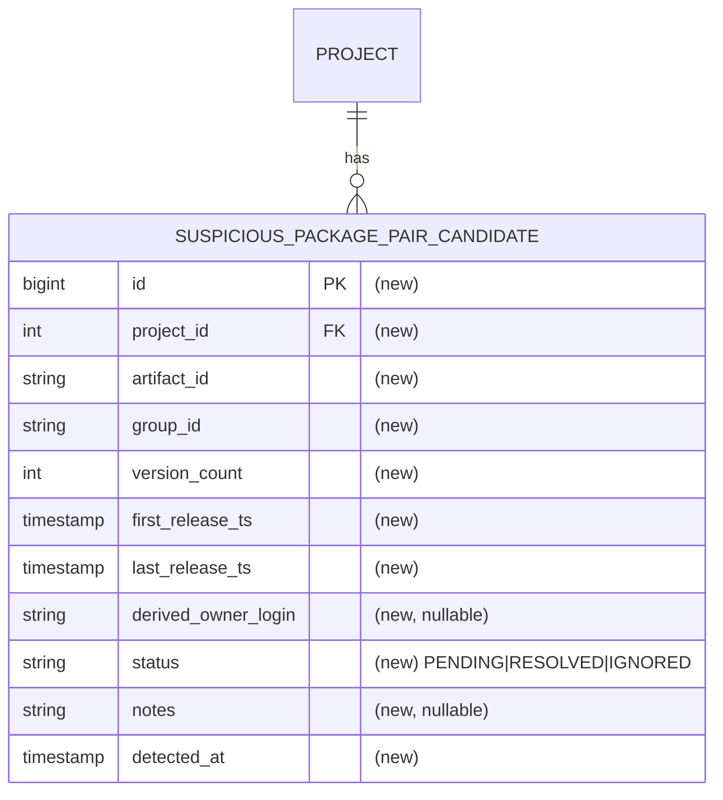

# Spec: Suspicious package-pair candidate collection

## 1. Goal
Find cases where the same `artifactId` is published under more than one `groupId` within a single indexed project, and store each one in a table a reviewer can work through. A scheduled job recomputes the conflict set on a fixed cadence and records each entry with the signals a reviewer needs (release history and a derived owner) plus a review lifecycle (`status` and reviewer `notes`). This task detects and collects the cases only; it makes no ban or verdict decision.

## 2. Problem
klibs.io needs a way to ban packages that impersonate a real library: the same artifact republished under a different `groupId` while pointing at the original project's repository (KTL-4151). Before anything can be banned, the candidate cases have to be collected somewhere — which `(artifactId, groupId)` entries conflict within a project, the release history and derived owner for each, and the outcome once a reviewer handles them. Nothing collects or stores this today. This task builds that collection step and produces the input the ban work will draw on.

Affected: klibs.io maintainers reviewing possible impersonation, and the later ban pipeline that consumes the reviewed cases.

## 3. User scenarios & acceptance

### Scenario 1 — Suspicious pairs are detected and collected (P1)
- **Given:** the catalogue contains a project where one `artifactId` is published under two distinct `groupId`s.
- **When:** the collection job runs.
- **Then:** one row per `(project_id, artifact_id, group_id)` entry exists in the candidate table, each with `status = PENDING` and a `detected_at` timestamp.
- **Independent test:** a DB-integration test seeds `package` rows forming a conflicting pair, runs the recompute, and asserts the entry rows exist with `PENDING`.

### Scenario 2 — Reviewer decisions survive re-runs (P1)
- **Given:** a reviewer has set a candidate row to `RESOLVED` or `IGNORED`.
- **When:** the collection job runs again while the pair still conflicts.
- **Then:** the row's `status` and reviewer `notes` are unchanged (status is not reset to `PENDING`) and no duplicate row is created. Only the signal columns may be refreshed.
- **Independent test:** a DB-integration test marks a row `RESOLVED`, re-runs the recompute, and asserts the status is still `RESOLVED` with exactly one row for that key.

### Scenario 3 — Owner is derived only for GitHub-account coordinates (P1)
- **Given:** two entries, one under `io.github.alice`, one under `com.example`.
- **When:** they are collected.
- **Then:** the `io.github.alice` row has `derived_owner_login = alice`; the `com.example` row has `derived_owner_login = NULL`.
- **Independent test:** a DB-integration test asserts both rows' `derived_owner_login`.

### Edge cases
- A pair can stop conflicting on a later run only if an entry's packages are removed. Indexing never deletes packages (it only inserts new versions or updates existing rows) and a package's `group_id` never changes; the only deletion path is the admin ban flow (`DELETE FROM package`). Rows are kept as they are, with their last `status` and `notes`, as an audit record; the upsert never deletes rows that drop out of detection.
- The two entries of a pair are indexed at different times, so the conflict is recorded on the first scheduled run after both entries exist in `package`. No backfill is needed: the first run seeds every conflict already present in the catalogue.

## 4. Functional requirements
- **FR-001:** For every `(project_id, artifact_id)` where that `artifactId` is published under more than one distinct `groupId` within the project, the system MUST record one row per `(project_id, artifact_id, group_id)` entry.
- **FR-002:** Each row MUST expose `version_count`, `first_release_ts`, and `last_release_ts` for that entry.
- **FR-003:** Each row MUST persist its full coordinate (`project_id`, `artifact_id`, `group_id`) as readable columns, so a reviewer can identify an entry and pull every entry that shares its `(project_id, artifact_id)` group.
- **FR-004:** For every `(project_id, artifact_id)` conflict, the system MUST record all of its entries; it MUST NOT pre-filter candidates by any signal (dormancy, owner mismatch, etc.). Triage is manual.
- **FR-005:** Each row MUST expose `derived_owner_login` equal to the lower-cased owner segment of an `io.github.<owner>` or `com.github.<owner>` coordinate, and it MUST be `NULL` when the `group_id` is not of that form.
- **FR-006:** The system MUST provide a nullable free-text `notes` field for reviewers to record why a row was moved to `RESOLVED` or `IGNORED`. The collection job populates the table but MUST NOT write or overwrite `notes`.
- **FR-007:** A newly detected entry MUST be recorded with `status = PENDING` and a `detected_at` timestamp.
- **FR-008:** `status` MUST be one of `PENDING`, `RESOLVED`, `IGNORED`.
- **FR-009:** A reviewer-set `status` and `notes` MUST persist across subsequent collection runs; a re-run MUST NOT revert a `RESOLVED` or `IGNORED` row to `PENDING` or clear its `notes`.
- **FR-010:** A collection run MUST NOT create duplicate rows for the same `(project_id, artifact_id, group_id)` entry.
- **FR-011:** When a previously recorded entry is no longer detected as conflicting, the system MUST keep its existing row unchanged; it MUST NOT delete rows that drop out of detection.

## 5. Non-functional requirements
- **Performance and dataset size:** the output is small. An exploratory query against a production copy produced about 2,100 conflicting entry rows (about 1,000 `(project_id, artifact_id)` conflicts) across about 200 projects. Detection is a single set-based query over `package` (filtered `project_id IS NOT NULL`) run on a schedule: it aggregates per `(project_id, artifact_id, group_id)` and keeps only the entries whose `(project_id, artifact_id)` spans more than one `group_id`. PostgreSQL handles it in seconds (a sequential scan plus hash aggregation) even at hundreds of thousands to millions of rows. The indexing pipeline is not touched, so no per-package cost is added.
- **External rate limits:** none. Detection and every stored column come from the local `package` table. `derived_owner_login` is a string parse of `group_id`. No GitHub, Maven Central, or OpenAI calls.
- **Concurrency:** detection is a standalone scheduled job under its own `@SchedulerLock` (ShedLock), so only one instance runs it. The upsert (FR-009, FR-010) is idempotent on the unique `(project_id, artifact_id, group_id)` key, so any re-run, scheduled or manual, never duplicates or resets a row. It shares the single-threaded scheduler with the other jobs; a daily cadence keeps its footprint on that thread small (see §8).
- **Observability:** each run logs a summary (rows inserted, rows signal-updated, total candidates). The first run's insert count can be checked against the ~2,100-row baseline above to confirm the seed worked.

## 6. Out of scope
- Any verdict or classification (impersonation vs. namespace migration, monorepo, transfer, relocation, fork) and any ban action.
- GitHub API ownership or fork verification (whether `derived_owner_login` actually owns the repo; comparing it against the real `scm_owner.login`). This task stores the signals; verification and the decision come later.
- Domain-type `groupId` owner resolution. Domain coordinates give only a domain, not an account, so those rows keep `derived_owner_login = NULL`. Only `io.github.*` and `com.github.*` are parsed; `io.gitlab.*` and other hosts are out.
- Any pre-filtering or ranking of candidates. All conflicting entries are collected; the reviewer applies judgement.
- Any reviewer UI or API endpoint. The table is populated only.
- Auto-correlation with `banned_packages`. When an entry is banned its `package` rows are deleted, so it drops out of detection and its row is kept as-is (FR-011); marking such rows automatically by cross-referencing `banned_packages` is out of scope.
- Repo rename or transfer (301) normalization, already handled upstream by indexing.

## 7. Klibs.io technical surface
- **Modules touched:** `core/package` gets a new candidate `@Entity`, a Spring Data repository, a collector service, and one native detection query (the full recompute). This is the JPA module that owns the `package` table the query scans, and it already hosts a native-aggregation precedent, `findAllKnownMavenCentralPackages`. `app` gets one new scheduled job class, modelled on `RefreshDependentCountJob`, that invokes the collector. The indexing pipeline is not modified.
- **Database:** one additive migration in `db/migration/2026-Q3/`, registered in `db.changelog-master.yml`. The table ships empty and is populated by the job; its first run seeds all pre-existing conflicts.
  1. Candidate table (working name `suspicious_package_pair_candidate`). Fields: `id` (PK, identity); `project_id` (FK to `project`); `artifact_id`; `group_id`; `version_count`; `first_release_ts`; `last_release_ts`; `derived_owner_login` (nullable); `status` (`PENDING`/`RESOLVED`/`IGNORED`); `notes` (nullable, reviewer-authored); `detected_at`. Group key `(project_id, artifact_id)`; unique `(project_id, artifact_id, group_id)`. Exact column types and index choices are plan-level.
- **Persistence style:** JPA, per CLAUDE.md ("JPA-first, avoid JDBC in new code"). The candidate table is a `@Entity` with a Spring Data repository (insert, status-preserving upsert, read); `project_id` is a plain column with the FK enforced in the migration, not a JPA `@ManyToOne`, so the entity adds no `core/package` → `core/project` dependency. Detection is a single `@Query(nativeQuery = true)` that returns an interface projection, the same shape as `findAllKnownMavenCentralPackages`. A native `@Query` inside a JPA repository is not JDBC.
- **Search and materialized views:** none. Independent of `project_index` and `package_index`.
- **External integrations:** none.
- **Scheduled jobs:** one new recurring job, a periodic full recompute modelled on `RefreshDependentCountJob` (`@Scheduled(fixedRate = …)`, `@SchedulerLock`, `@ConditionalOnProperty`). Cadence is daily (`fixedRate = 1, timeUnit = DAYS`), because the conflict set changes slowly and the review queue does not need sub-day freshness; the cadence is a one-line change if it needs tuning. No backfill mechanism is needed: the first run seeds every conflict already in `package`. `@SchedulerLock(lockAtMostFor = …)` bounds a stuck run, and the recompute method stays independently callable for tests and manual re-seeding.
- **Storage:** none.
- **Configuration:** a `klibs.*` feature toggle gating the job, following the `@ConditionalOnProperty` pattern the sibling jobs use with `klibs.indexing`.
- **API surface:** none.
- **Frontend contract:** none.

## 8. Design decisions

### Decision — Detection is a native `@Query`, not a persisted view
- **Choice:** conflicts are computed by one read-only native `@Query` over `package` (filtered `project_id IS NOT NULL`). It aggregates per `(project_id, artifact_id, group_id)`, giving each entry its own `version_count`, `first_release_ts`, and `last_release_ts`, and keeps only the entries whose `(project_id, artifact_id)` spans more than one distinct `group_id` (a subquery or window over the `(project_id, artifact_id)` grouping supplies that cross-group test). Its rows map one-to-one onto candidate rows and are written straight to the table; no SQL view is created.
- **Why:** the detection query has a single consumer, this collector, so a persisted view would add a migration and a schema object with no other reader. A native `@Query` in the repository is the established idiom (`findAllKnownMavenCentralPackages` is a sibling aggregation; `findDuplicateDescriptions` is a related `GROUP BY … HAVING COUNT > 1` precedent, on top of which this query adds a cross-group filter). The `project_id IS NOT NULL` filter is needed because `package.project_id` is nullable, and an intra-project pair requires a project.
- **Rejected:** a standalone `suspicious_package_pair` view, an extra DB object read by only one caller.

### Decision — Persist detected pairs to a table
- **Choice:** a physical candidate table populated by the job, keyed on `(project_id, artifact_id, group_id)`.
- **Why:** detection on its own is stateless. A review queue needs durable rows that hold reviewer state (`status`, `notes`, `detected_at`) and survive recomputation.
- **Rejected:** compute conflicts on demand with no persistence, which leaves nowhere to record that a human already reviewed a case.

### Decision — `derived_owner_login` parsing rule
- **Choice:** if `group_id` matches `io.github.<owner>[...]` or `com.github.<owner>[...]`, set `derived_owner_login` to `<owner>` lower-cased; otherwise `NULL`. Computed during collection.
- **Why:** in the catalogue the only account-host coordinates are `io.github.*` and `com.github.*`. Every other `group_id` is domain-type and yields only a domain, so it gets `NULL`. It is stored lower-cased because GitHub logins are case-insensitive, which gives a canonical form for the later comparison against `scm_owner.login` (an out-of-scope verification step, §6).
- **Rejected:** inferring an owner from a reversed domain, which is unsound.

### Decision — Detection is a standalone periodic recompute job
- **Choice:** detection runs as its own scheduled job that periodically runs the full recompute and upserts the result. The indexing pipeline is left alone. Cadence is daily, because the conflict set changes slowly and nothing acts on a conflict in real time. There is no one-time backfill and no per-package hook: the first run seeds all pre-existing conflicts, and every later run re-derives the full set.
- **Why:**
  1. Correctness that recovers on its own. Every run recomputes the whole conflict set from `package`, so a transient failure, a skipped run, a deploy gap, or a bug is corrected on the next run. No state can be permanently missed.
  2. No risk to indexing. The job does not touch `PackageIndexingService` or the queue-drain path, so a detection bug cannot slow, break, or roll back indexing. It affects only this one job.
  3. Small surface, no backfill. One job, one query (the recompute we would write anyway), one collector, a toggle, and a migration. No transaction-boundary reasoning, no second targeted query, no separate backfill runner: the first run is the backfill.
  4. Freshness does not matter here. A reviewer works through the queue over days (§1, §6), and nothing acts on a conflict automatically, so finding a conflict in seconds rather than hours gains nothing.
  5. Precedent and affordable cost. It mirrors `RefreshDependentCountJob`, an accepted periodic full-recompute of a catalogue-wide derived set on the same single-threaded scheduler, with a heavier workload (the dependency graph) and a tighter cadence (6h) than this daily aggregation. The scheduler thread is already occupied for hours by the queue drain (`lockAtMostFor = 4h`) and the daily Maven index (`lockAtMostFor = 23h`); a daily seconds-long aggregation adds little next to those.
- **Rejected — inline per-package hook plus one-time backfill:** this catches a conflict the moment its second package commits and adds no recurring job (though it still adds a run-once backfill runner, itself a `@Scheduled` method). But it (a) edits the indexing path (`processPackageQueue`) and takes on transaction-boundary risk; (b) needs a second, targeted query plus a separate backfill runner; and (c) in its post-commit form, a swallowed detection error, or a crash or deploy between the package commit and the hook, is never retried, so that candidate is missed until a package in the pair is reindexed or the backfill is re-run by hand (re-discovering an already-indexed coordinate does not re-emit it, so it cannot heal the miss). An in-transaction variant closes that miss, since a rollback leaves the package absent and the coordinate is re-emitted on a later cycle, but it discards the request's already-fetched POM and GitHub work on every rollback and still edits the indexing path. Neither variant is clearly better than the recompute for a queue that does not need real-time detection.
- **Rejected — a tail-of-drain step:** this conflates "queue drained" with "data complete." The drain is priority-ordered (`released_ts DESC NULLS FIRST`) and can run well past its 4h lock under a backlog, so it offers no real completeness guarantee.

### Decision — Candidate PK type
- **Choice:** a `bigint` identity PK for the candidate table.
- **Why:** the table is retained indefinitely (rows are kept as an audit record and never deleted, FR-011), so it only grows. `bigint` is the safe default, costs nothing now, and avoids a future widening migration. A generated identity is simplest for JPA. It is called out because it differs from the sibling `project` `int`/`SERIAL` PK.
- **Rejected:** `int`/`SERIAL`, fine at today's scale, but `bigint` future-proofs the PK for free. The FK column (`project_id`) stays `int` to match `project.id`.

## 9. Key entities (only if data model changes)
- **`SuspiciousPackagePairCandidate`** (working name): one row per entry of a conflicting pair.
  - **Key fields:** `id` (PK); `projectId` to `project`; `artifactId`; `groupId`; `versionCount`; `firstReleaseTs`; `lastReleaseTs`; `derivedOwnerLogin` (nullable); `status` (`PENDING`/`RESOLVED`/`IGNORED`); `notes` (nullable, reviewer-authored); `detectedAt`.
  - **Relationships:** many candidates per `project`; group key `(projectId, artifactId)`; unique `(projectId, artifactId, groupId)`.
  - **Lifecycle:** created `PENDING` by the job. A reviewer moves it to `RESOLVED` or `IGNORED` and may add `notes`. `status` and `notes` stay put across runs.

## 10. Database schema diagram (only if schema changes)

## 11. Test strategy
- **Unit:** the `derived_owner_login` parser (`io.github.*` and `com.github.*` to a lower-cased owner; other to null; mixed-case input lower-cased) and the upsert-merge decision (preserve `status` and `notes` vs. insert `PENDING`), as pure-function unit tests. Both are pure logic, so they need no DB and no mock.
- **DB-integration (`BaseUnitWithDbLayerTest`):** method-level `@Sql` seeds build conflicting pairs; run the recompute and assert Scenario 1 (all entries recorded `PENDING`), Scenario 2 (a second run preserves a reviewer's `RESOLVED` status and `notes`, with no duplicates), and Scenario 3 (derived owner null vs. value). Also assert the recompute ignores a single-`groupId` artifact, skips `project_id IS NULL` packages, computes `version_count`, `first_release_ts`, and `last_release_ts` correctly from an entry's seeded versions (FR-002), keeps an existing row unchanged when its entry stops conflicting after a seeded `package` row is removed (FR-011), and that a first run against a pre-seeded catalogue produces the expected rows (the "no backfill needed" property).
- **Web and smoke:** none, since there is no endpoint.
- *Reviewer-only, manual on staging:* run the job against a production DB copy, confirm the first-run insert count roughly matches the ~2,100-row baseline, then hand-edit a status and confirm it survives the next run.

## 12. Assumptions
- **Detection semantics:** a `(project_id, artifact_id)` conflicts when it spans more than one distinct `group_id`, and the query records one entry row per `(project_id, artifact_id, group_id)` with that entry's own `version_count`, `first_release_ts`, and `last_release_ts`.
- **Detection is recompute-based:** each scheduled run recomputes the full conflict set from `package`. A pair appears on the first run after both entries are committed. No backfill is needed, since the first run seeds pre-existing conflicts, and a missed or failed run is corrected on the next one because every run re-derives the whole set.
- **`package.project_id` is nullable:** a package with no resolved GitHub repo has no project, so detection filters `project_id IS NOT NULL`. An intra-project pair requires a project.
- **`package` is authoritative** for detection and timestamps: it carries `project_id`, `group_id`, `artifact_id`, `version`, and `release_ts` (NOT NULL), with a unique `(group_id, artifact_id, version)`, so `version_count`, `first_release_ts`, and `last_release_ts` are computable locally.
- **Indexing never deletes packages** (verified in code): the pipeline only inserts new package-versions or updates existing rows (reindex, description and version-type backfill), and a package's `group_id` never changes. The only path that removes `package` rows is the admin ban flow (`BlacklistService`, `DELETE FROM package`), which also excludes the coordinate from re-indexing through a `banned_packages` `NOT EXISTS` filter. So a detected pair stops conflicting only when an entry is banned, which is why rows are kept as an audit record (FR-011).
- **Banned coordinates never surface as candidates:** their `package` rows are deleted on ban and never re-indexed, so a scan over `package` cannot produce a candidate for them.
- All conflicting entries are collected, with no pre-filtering; the reviewer applies judgement.
- `derived_owner_login` is deterministic only for `io.github.*` and `com.github.*`; domain-type coordinates stay `NULL`, and it is not the same as the real `scm_owner.login`.
- No external API is needed to populate any column.
- Prod scale: about 2,100 conflicting entry rows (about 1,000 `(project_id, artifact_id)` conflicts) across about 200 projects, which is the output size. Each run scans the whole `package` table as one set-based aggregation that stays cheap (seconds) at hundreds of thousands to millions of rows; it runs daily.

## 13. References
- **Primary precedent, periodic full-recompute job (in-repo):** `app/src/main/kotlin/io/klibs/app/job/RefreshDependentCountJob.kt` (`@Scheduled(fixedRate = 6, HOURS)`, `@SchedulerLock(lockAtMostFor = "1h")`, gated on `klibs.indexing`), a catalogue-wide derived-set recompute on the shared single-threaded scheduler; this job mirrors it at a lighter daily cadence. Recompute SQL prior art: `core/project/src/main/kotlin/io/klibs/core/project/repository/ProjectRepositoryJdbc.kt` (`recomputeAllDependentCounts`); the per-project column was added in `db/migration/2026-Q2/2026-04-24_add_project_dependent_count_column.yml`.
- **Scheduling and single-thread config (in-repo):** `app/src/main/kotlin/io/klibs/app/configuration/SchedulingConfiguration.kt` (no `TaskScheduler` bean, so a single-threaded scheduler is shared by all `@Scheduled` methods). That thread is already occupied for hours by `ProcessPackageIndexRequestJob` (queue drain, `fixedRate = 4h`, `lockAtMostFor = 4h`) and `IndexNewPackagesJob` (`cron 0 0 2 * * *`, `lockAtMostFor = 23h`); the frequent light jobs (GitHub owner/repo 30s, AI description/tags ~60s, MV refresh 10m) already yield to those. A daily seconds-long aggregation is small next to that load.
- **JPA native-query precedent (in-repo):** `PackageRepository.findAllKnownMavenCentralPackages` (native `GROUP BY`/`ARRAY_AGG` returning a `PackageVersionsView` interface projection, the precedent for the recompute); `findDuplicateDescriptions` (native `GROUP BY … HAVING COUNT(*) > 1`) is a related detection precedent, on top of which this query adds a cross-group filter. Both use `@Query(nativeQuery = true)`. Note: `package` has a DB unique constraint on `(group_id, artifact_id, version)` and single-column indexes on `project_id` and `artifact_id`.
- **Ban flow (in-repo):** `BlacklistService` and `BlacklistRepositoryJdbc` (`DELETE FROM package`); `IndexingRequestRepository.findFirstForIndexing` (the `banned_packages` `NOT EXISTS` filter); table `banned_packages` (`db/migration/2025-Q1/2025-03-21_add_banned_packages_table.yml`).
- **Alternative approach (rejected):** the inline per-package hook variant is captured as the rejected alternative in §8.
- **Tickets:** KTL-4790 (this task, collect potential cases in the table), which supports KTL-4151 (ban packages linked to the original repository) and builds on KTL-4617 (detection) and KTL-4618 (secondary clues and the owner-derivation rule).
