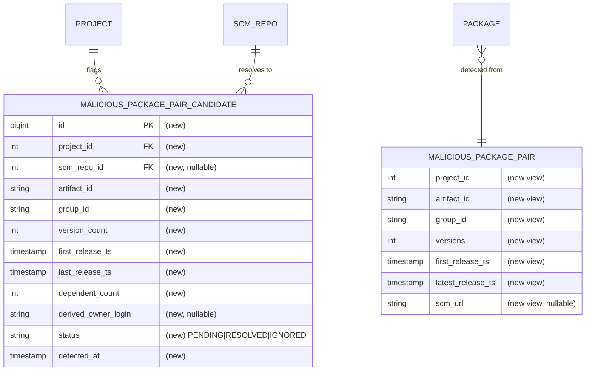

# Spec: Malicious package-pair candidate collection

## 1. Goal
Detect "suspicious package pairs" (the same `artifactId` published under more than one `groupId` within a single indexed project) **and** persist each detected branch into a durable, reviewable table — enriched with dormancy, ownership and dependent-count signals and a review-status lifecycle — populated by a scheduled process so a human can triage cases over time. This task is **self-contained**: it owns both the detection and the collection. It covers **data collection for manual review only**; it makes no ban/verdict decision.

## 2. Problem
- We have no durable record of suspicious package pairs. The KTL-4617 spike demonstrated the detection as a throwaway SQL view on an unmerged branch (`spike/KTL-4617-...`); nothing that ships today computes or stores these cases.
- A live view (the spike's approach) holds **no reviewer state** and a case silently appears/disappears as the catalogue changes — there is no way to record "a human already looked at this."
- Reviewers additionally need signals the raw catalogue doesn't expose per branch: a `groupId`-derived owner login (the deterministic ownership clue from KTL-4618), a per-branch **dependent count** (blast radius), and per-branch dormancy timestamps.
- **Who's affected:** klibs.io maintainers / security reviewers triaging potential impersonation or typo-/name-squat republishes; downstream, the future automated ban pipeline that will consume reviewed cases.

## 3. User scenarios & acceptance

### Scenario 1 — Suspicious pairs are detected and collected (P1)
- **Given:** the catalogue contains a project where one `artifactId` is published under two distinct `groupId`s.
- **When:** the collection process runs.
- **Then:** one row per `(project_id, artifact_id, group_id)` branch exists in the candidate table, each with `status = PENDING` and a `detected_at` timestamp.
- **Independent test:** DB-integration — seed `package` rows forming a conflicting pair, run collection, assert the expected branch rows exist with `PENDING`.

### Scenario 2 — Reviewer decisions survive re-runs (P1)
- **Given:** a reviewer has set a candidate row to `RESOLVED` (or `IGNORED`).
- **When:** the collection process runs again while the pair still conflicts.
- **Then:** the row's status is unchanged (not reset to `PENDING`) and no duplicate row is created; only the signal columns may be refreshed.
- **Independent test:** DB-integration — mark a row `RESOLVED`, re-run collection, assert status still `RESOLVED` and exactly one row for that group key.

### Scenario 3 — Owner is derived only for GitHub-account coordinates (P1)
- **Given:** two branches, one under `io.github.alice`, one under `com.example`.
- **When:** collected.
- **Then:** the `io.github.alice` branch row has `derived_owner_login = alice`; the `com.example` branch row has `derived_owner_login = NULL`.
- **Independent test:** DB-integration asserting both rows' `derived_owner_login`.

### Edge cases
- Same `artifactId` under **3+ groupIds** → 3+ branch rows sharing the `(project_id, artifact_id)` group key.
- A branch with a null `scm_url` → repo fields nullable, still recorded. (Every branch has ≥1 release because it derives from `package` rows, so release timestamps are always present.)
- **`dependent_count` unknown vs zero** — must be distinguishable if the source can't compute one. `[NEEDS CLARIFICATION: is 0 an acceptable stand-in for "unknown", or must NULL mean unknown?]`
- A pair that **no longer conflicts** on a later run (a branch was removed/merged). `[NEEDS CLARIFICATION: should stale candidate rows be deleted, retained as-is, or flagged (e.g. a last-seen marker)?]`

## 4. Functional requirements
- **FR-001:** For every `(project_id, artifact_id)` where that `artifactId` is published under more than one distinct `groupId` within the project, the system MUST record one row per `(project_id, artifact_id, group_id)` branch.
- **FR-002:** Each row MUST expose `version_count`, `first_release_ts` and `last_release_ts` for that branch.
- **FR-003:** Each row MUST expose `project_id` (the group key with `artifact_id`) and the branch project's `scm_repo_id`.
- **FR-004:** For **every** `(project_id, artifact_id)` conflict, the system MUST record all of its branches — it MUST NOT pre-filter candidates by any signal (dormancy, owner mismatch, dependent count, etc.). Triage is manual.
- **FR-005:** Each row MUST expose `derived_owner_login` equal to the owner segment of an `io.github.<owner>` coordinate, and MUST be `NULL` when the `group_id` is not of that form.
- **FR-006:** Each row MUST expose a `dependent_count` for the branch's coordinate. `[NEEDS CLARIFICATION: counted per group:artifact (aggregated over versions) or per exact group:artifact:version? and does it count dependent projects or dependent packages?]`
- **FR-007:** A newly detected branch MUST be recorded with `status = PENDING` and a `detected_at` timestamp.
- **FR-008:** `status` MUST be one of `PENDING`, `RESOLVED`, `IGNORED`.
- **FR-009:** A reviewer-set status MUST persist across subsequent collection runs — a re-run MUST NOT revert a `RESOLVED`/`IGNORED` row to `PENDING`.
- **FR-010:** A collection run MUST NOT create duplicate rows for the same `(project_id, artifact_id, group_id)` branch.

## 5. Non-functional requirements
- **Performance / dataset size:** small — the KTL-4617 spike run against a prod copy produced ~1,000 branch rows across ~200 projects. A full recompute-and-upsert per run is acceptable.
- **External rate limits:** **none.** Detection and every column are computed from existing local tables (`package`, `project`, `scm_repo`, `scm_owner`, `package_dependency`, `maven_artifact`). `derived_owner_login` is a pure string parse of `group_id`. No GitHub / Maven Central / OpenAI calls. (Contrast: fork/ownership *verification* against the GitHub API is out of scope — see §6.)
- **Concurrency:** collection runs as a single scheduled job guarded by a ShedLock lock so replicas don't double-run; the upsert (FR-009/010) must be safe under a concurrent re-run.
- **Observability:** log per-run counts (rows inserted / signal-updated / total candidates).

## 6. Out of scope
- Any **verdict / classification** (impersonation vs namespace-migration / monorepo / transfer / relocation / fork) and any **ban** action. (A `banned_packages` table already exists and the spike cross-checked against it; wiring auto-resolution from it is a later ticket.)
- **GitHub API ownership/fork verification** (does `derived_owner_login` actually own the repo; comparing `derived_owner_login` against the real `scm_owner.login`) — this collection stores the *signals*; verification and decision are later tickets.
- **Domain-type groupId owner resolution** — irreducible (domain↔account gap, KTL-4618); such rows keep `derived_owner_login = NULL`. (`io.gitlab.*` and other hosts are also out — `io.github.*` only.)
- Any **pre-filtering / ranking of candidates** — all conflicting-pair branches are collected; the reviewer applies judgement. (The detection view naturally computes ranking signals such as `release_rank` / `days_after_original`; storing those is design headroom, not required by this task's schema.)
- Any **reviewer UI / API endpoint** — the table is populated only; reviewers act on it directly (a review surface is a later ticket).
- Repo rename/transfer (301) normalization — already handled upstream by indexing.

## 7. Klibs.io technical surface
- **Modules touched:** `app` (new scheduled job in `io.klibs.app.job`, mirroring `RefreshDependentCountJob`); new entity + repository in `core/project` (the candidate row is project-scoped, joining `project` + `scm_repo`).
- **Database — two additive migrations in `db/migration/2026-Q3/`** (registered in `db.changelog-master.yml`), no backfill (the job populates):
  1. **Detection view** `malicious_package_pair` — created *by this task* from the KTL-4617 spike SQL (see §8 / §13). One row per `(project_id, artifact_id, group_id)` branch of a conflicting pair, exposing `versions`, `first_release_ts`, `latest_release_ts`, `scm_url`. Reused verbatim from the spike as the reviewed detection semantics; not depended upon from another branch.
  2. **Candidate table** (working name `malicious_package_pair_candidate`). Fields: `id` (PK, identity); `project_id` (FK → `project`); `scm_repo_id` (FK → `scm_repo`, nullable); `artifact_id`; `group_id`; `version_count`; `first_release_ts`; `last_release_ts`; `dependent_count`; `derived_owner_login` (nullable); `status` (`PENDING`/`RESOLVED`/`IGNORED`); `detected_at`. Group key `(project_id, artifact_id)`; unique `(project_id, artifact_id, group_id)`. Exact column types/index choices are plan-level.
- **Persistence style:** **JPA** for the candidate table — a `@Entity` + Spring Data `JpaRepository`, per CLAUDE.md ("JPA-first … avoid JDBC in new code"). The one unavoidable raw-SQL touch is *reading the detection view*, done via a read-only projection / native query; nothing new is written through JDBC. See §8.
- **Search / materialized views:** none — independent of `project_index` / `package_index`.
- **External integrations:** none.
- **Scheduled jobs:** new `@Scheduled` collection job with a dedicated `@SchedulerLock` name; idempotent upsert; gated behind a `@ConditionalOnProperty` toggle. Runs **daily, after the 2 AM indexing pass** (`IndexNewPackagesJob` is `cron = "0 0 2 * * *"`) so it sees freshly-indexed packages — pick a later cron to guarantee ordering. Independently re-runnable.
- **Storage:** none.
- **Configuration:** a `klibs.*` feature toggle to enable/disable collection (pattern: `@ConditionalOnProperty`, e.g. sibling jobs use `klibs.indexing`).
- **API surface:** none.
- **Frontend contract:** none.

## 8. Design decisions

### Decision — This task owns detection; create the view here rather than depend on KTL-4617
- **Choice:** ship the `malicious_package_pair` view as a migration *in this task's branch*, copied from the KTL-4617 spike SQL, and build collection on top of it.
- **Why:** the spike's view lives only on an unmerged branch; making KTL-4790 self-contained removes a cross-branch merge-ordering dependency and lets it be built and tested in isolation.
- **Rejected:** wait for / rebase onto a merged KTL-4617 view (couples this task to another ticket's landing); re-derive detection independently (drift from the reviewed spike semantics).
- **Revisit if:** KTL-4617 lands its own productionized detection first — then this task consumes it instead of re-creating it.

### Decision — Persist to a table, not keep the live view alone
- **Choice:** a physical candidate table populated by a job, keyed on `(project_id, artifact_id, group_id)`; the view remains the detection source only.
- **Why:** the view cannot hold reviewer state (`status`, `detected_at`) or survive across recomputations; a review queue needs durable, stably-addressable rows.
- **Rejected:** store only status in a side table keyed to the view (the view's rows aren't stably addressable across recomputes).

### Decision — JPA for the candidate table; raw SQL only to read the view
- **Choice:** the writable candidate table is a JPA `@Entity` with a Spring Data repository; the detection view is read through a read-only native query / projection.
- **Why:** CLAUDE.md is JPA-first and explicitly says avoid JDBC in new code. Only the set-based read of a SQL view genuinely needs native SQL; the persistence and upsert of candidates fit JPA cleanly.
- **Rejected:** raw JDBC for the whole feature (the spike's / a prior draft's choice) — conflicts with the working agreement and isn't needed once detection is a view.
- **Revisit if:** the upsert-preserving-status semantics (below) prove awkward in JPA and measurably need a native upsert.

### Decision — `derived_owner_login` parsing rule
- **Choice:** if `group_id` matches `io.github.<owner>[...]`, set `derived_owner_login` = `<owner>` (lower-cased); otherwise `NULL`. Computed during collection.
- **Why:** KTL-4618 established that account attribution is deterministic **only** for GitHub-account coordinates; domain-type coordinates give only the domain (domain↔account gap is irreducible), so they get `NULL`. This is distinct from the project's real `scm_owner.login`; comparing the two is a later verification step (§6).
- **Rejected:** owner inference from reversed domains (unsound).
- **Revisit if:** we support `io.gitlab.<owner>` or verify domain ownership out-of-band.

### Decision — `dependent_count` source and granularity
- **Choice:** derive a **per-branch** count from the existing `package_dependency` + `maven_artifact` reverse-lookup tables (the data `RefreshDependentCountJob` / `ProjectRepositoryJdbc.recomputeAllDependentCounts` already use), scoped to the branch's `group_id:artifact_id`.
- **Why:** the stored `project.dependent_count` is **per project** (verified: `GROUP BY project_id`, counts distinct consumer projects) — the wrong granularity, since a branch is one coordinate within a project and the whole point is to compare branches.
- **Rejected:** reuse `project.dependent_count` (both branches of a pair would show the same project-level number).
- **Open:** `[NEEDS CLARIFICATION: per group:artifact vs per group:artifact:version; count distinct dependent projects vs dependent packages]` (also FR-006).

### Decision — Idempotent upsert that preserves reviewer state
- **Choice:** on each run, upsert on `(project_id, artifact_id, group_id)`: insert new branches as `PENDING` with `detected_at = now`; for existing rows, refresh the signal columns only and leave `status` and `detected_at` untouched.
- **Why:** satisfies FR-009 (decisions persist) and FR-010 (no duplicates).
- **Rejected:** truncate-and-reload (destroys reviewer state).

### Decision — Standalone scheduled job vs inline in indexing
- **Choice:** a standalone `@Scheduled` + `@SchedulerLock` job (mirrors `RefreshDependentCountJob`), triggered after indexing.
- **Why:** the task permits "a job or integrate into indexing"; a standalone job is independently re-runnable, testable, and toggleable, and keeps indexing's concerns unmixed.
- **Rejected:** inline in the indexing pipeline (couples unrelated concerns, harder to re-run in isolation).

### Decision — Candidate PK type
- **Choice:** `bigint` identity PK for the candidate table.
- **Why:** a growing collection log; a generated identity is simplest for JPA.
- **Rejected:** `SERIAL`/int (the `project` / `scm_repo` convention) — fine at today's scale, but bigint costs nothing and avoids a future migration. Called out because it diverges from those sibling tables' int PKs. FK columns (`project_id`, `scm_repo_id`) stay `int` to match `project.id` / `scm_repo.id` (both `SERIAL`).

## 9. Key entities (only if data model changes)
- **`MaliciousPairCandidate`** (working name) — one row per branch of a conflicting pair.
  - **Key fields:** `id` (PK); `projectId` → `project`; `scmRepoId` → `scm_repo` (nullable); `artifactId`; `groupId`; `versionCount`; `firstReleaseTs`; `lastReleaseTs`; `dependentCount`; `derivedOwnerLogin` (nullable); `status` (`PENDING`/`RESOLVED`/`IGNORED`); `detectedAt`.
  - **Relationships:** many candidates per `project`; group key `(projectId, artifactId)`; unique `(projectId, artifactId, groupId)`.
  - **Lifecycle:** created `PENDING` by the job → a reviewer moves it to `RESOLVED`/`IGNORED`; status is sticky across runs.

## 10. Database schema diagram (only if schema changes)

## 11. Test strategy
- **Unit:** the `derived_owner_login` parser (`io.github.*` → owner; other → null; case handling) and the upsert-merge decision (preserve status vs insert `PENDING`), mocking the repository boundary.
- **DB-integration (`BaseUnitWithDbLayerTest`):** method-level `@Sql` seeds building conflicting pairs; assert Scenario 1 (collection inserts `PENDING`), Scenario 2 (re-run preserves `RESOLVED`, no dupes), Scenario 3 (derived owner null vs value), and per-branch `dependent_count` off seeded `package_dependency` / `maven_artifact`. Also assert the detection view itself flags a seeded conflicting pair and ignores a single-groupId artifact.
- **Web / smoke:** none — no endpoint in this task.
- *Reviewer-only — manual / staging:* run the job on `klibs-stage` against a prod DB copy, confirm candidate counts roughly match the spike's ~1,000 rows, and that hand-editing a status survives a re-run.

## 12. Assumptions
- **Detection semantics = the KTL-4617 spike view** (verified by reading it): within a project, `count(DISTINCT group_id) > 1` for a given `artifact_id`; one branch row per `(project_id, artifact_id, group_id)`.
- **`package` is authoritative** for detection and timestamps: it has `project_id`, `group_id`, `artifact_id`, `version`, `release_ts` (NOT NULL) with a unique `(group_id, artifact_id, version)` — so `version_count`, `first_release_ts`, `last_release_ts` are computable locally.
- **Single-repo-per-project model** (KTL-4618): both branches of a pair resolve to one repo because indexing dedups renamed/transferred repos on GitHub `nativeId`; so `scm_repo_id` is well-defined per project (nullable if the project has no repo).
- All conflicting-pair branches are collected (no pre-filtering); the reviewer applies the funnel/judgement manually — that logic is a later ticket.
- `derived_owner_login` is deterministic only for `io.github.*`; domain-type coordinates remain `NULL` by design, and it is not the same as the real `scm_owner.login`.
- No external API is needed to populate any column.
- Prod scale ~1,000 branch rows / ~200 projects; small enough for full recompute-and-upsert per run.

## 13. References
- **KTL-4617 spike (git branch, NOT merged):** `spike/KTL-4617-potential-malicious-package-pairs-prototype` — `app/src/main/resources/db/migration/2026-Q3/2026-07-12_create_malicious_package_pair_view.sql` (detection view, reused verbatim here) and `scripts/sql/ktl-4617_malicious_package_pairs.sql` (ad-hoc analysis: summary / detail / `banned_packages` watchlist). These are the detection *semantics* reference; this task creates its own migration copy rather than depending on that branch. *(The earlier `~/klibs-data` spike notes referenced by the prior draft are no longer on disk.)*
- **Dependent-count prior art (in-repo, on this branch):** `app/src/main/kotlin/io/klibs/app/job/RefreshDependentCountJob.kt`; `core/project/src/main/kotlin/io/klibs/core/project/repository/ProjectRepositoryJdbc.kt` (`recomputeAllDependentCounts`, lines ~348–368); tables `package_dependency`, `maven_artifact`; per-project column added in `db/migration/2026-Q2/2026-04-24_add_project_dependent_count_column.yml`.
- **Scheduling pattern (in-repo):** `app/src/main/kotlin/io/klibs/app/configuration/SchedulingConfiguration.kt`; `RefreshDependentCountJob.kt` (`@Scheduled` + `@SchedulerLock` + `@ConditionalOnProperty`); `IndexNewPackagesJob.kt` (`cron = "0 0 2 * * *"`).
- **Tickets:** YouTrack KTL-4790 (this — collect potential cases in the table), building on KTL-4617 (detection) and KTL-4618 (secondary clues / owner-derivation rule).
