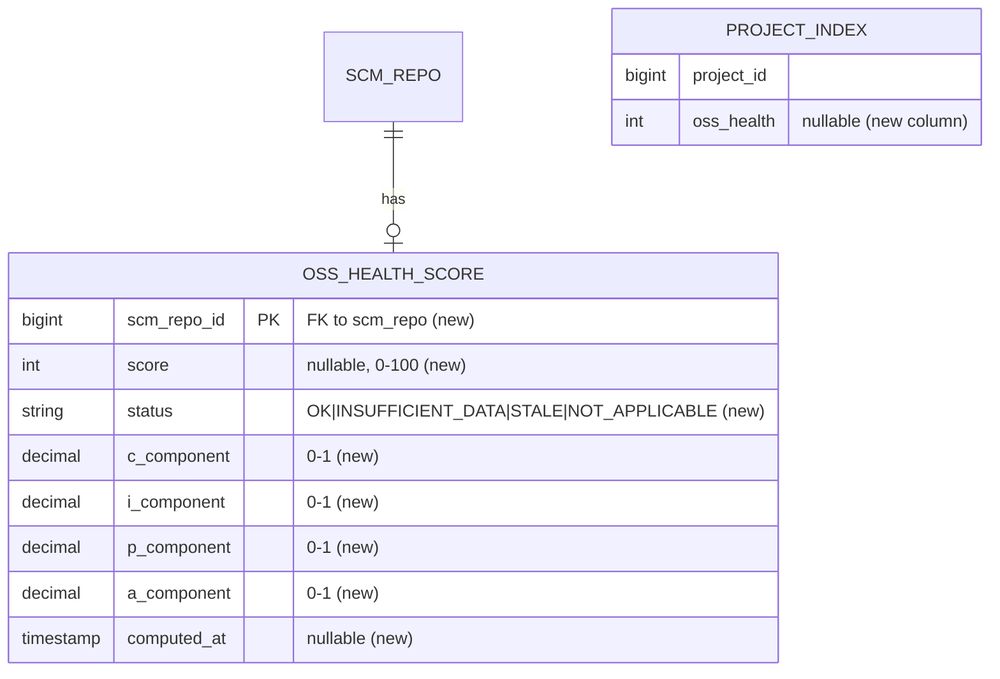

# Spec: OSS Health Metric

## 1. Goal
Compute and expose a per-project **OSS Health** score (0–100) — a composite, research-backed signal of repository activity and responsiveness — so that visitors of a klibs.io project page can judge whether a library is actively maintained without needing to skim GitHub themselves.

## 2. Problem
- klibs.io currently exposes only point-in-time GitHub fields per repository: `stars`, `open_issues`, `last_activity_ts`, `license`. None of these on their own tell a visitor whether a library is being actively maintained — a high-star library can be abandoned, a low-star one can be healthy.
- The research the RFC cites ([Iqbal et al., 2023](https://arxiv.org/abs/2309.12120v3)) shows that single raw indicators (stars, commit recency, issue counts) do not reliably identify OSS sustainability. A composite is needed.
- **Affected:** end users of klibs.io evaluating library trustworthiness; library maintainers who want a neutral, defensible signal of their project's activity surfaced on the platform.

## 3. User scenarios & acceptance

### Scenario 1 — Visitor sees health on a project page (P1)
- **Given:** a project whose backing GitHub repo has at least 12 weeks of recorded activity and the OSS Health score has been computed.
- **When:** the visitor opens the project details page (`/project/{ownerLogin}/{projectName}/details`).
- **Then:** the response includes an `ossHealth` field with an integer 0–100, plus the timestamp at which it was last computed.
- **Independent test:** seed `scm_repo` + an `oss_health_score` row with a fixture score; call the details endpoint; assert `ossHealth` is present and within [0, 100].

### Scenario 2 — Insufficient data is reported, not hidden silently (P1)
- **Given:** a project whose backing repo has fewer than 12 weeks of recorded commit/issue/PR activity, OR whose score has not yet been computed.
- **When:** the visitor opens the project details page.
- **Then:** `ossHealth` is `null` and the response carries a status (see FR-008) so the frontend can render *"Insufficient activity data"* rather than a misleading "0".
- **Independent test:** seed a brand-new repo with one commit; assert the field is `null`/insufficient and not `0`.

### Scenario 3 — Health stays fresh (P1)
- **Given:** a project whose score was last computed more than the eligibility window ago (default 7 days).
- **When:** time passes and the recompute runs.
- **Then:** the score is recomputed from the latest 12-week window of commit/issue/PR data and the stored `computed_at` moves forward, so a returning visitor never sees a score staler than the window.
- **Independent test:** seed a score row with an old `computed_at`; run the recompute against a stubbed `GitHubIntegration`; assert the row is upserted with a fresh `computed_at`.

### Scenario 4 — Recompute yields under rate-limit pressure (P1)
- **Given:** the recompute is about to process a repo, and the remaining GitHub API budget is below the safety margin.
- **When:** it runs.
- **Then:** it makes no GitHub call; the repo's `computed_at` is left untouched so it remains eligible later; a `oss_health_skipped_rate_limit_total` counter increments.
- **Independent test:** run the recompute with a fake `GitHubIntegration.getRateLimitInfo()` returning `remaining < safetyMargin`; assert no API call is made and the score row is unchanged.

### Edge cases
- **Repo younger than 12 weeks:** report insufficient data. Do not extrapolate (per RFC's "negative impact risk" note — a misleadingly low score is worse than no score).
- **Repo with zero issues / zero PRs over the window:** the Issue and PR sub-scores have undefined ratios. The ratio term contributes `0` but the median term keeps its full weight — see FR-006.
- **Repo with one contributor:** `TopContributorCommitShare = 1.0`, so the diversity sub-score becomes `0.6 * (1/5) + 0.4 * 0 = 0.12`. This is intended; a one-person project legitimately scores low on diversity.
- **Archived / disabled GitHub repo:** no score is computed or shown. If a score row already exists, it transitions to `status = NOT_APPLICABLE` with a null `score` — see FR-010.
- **Repository renamed / transferred:** the `nativeId` (numeric repo ID) is stable across renames; the score keys on `scm_repo.id` (derived from `nativeId`), not on `owner/name`.

## 4. Functional requirements

- **FR-001:** System MUST compute an OSS Health score in `[0, 100]` per scm-repository, defined as `100 * (0.30*C + 0.25*I + 0.25*P + 0.20*A)`, where the four sub-scores `C, I, P, A ∈ [0, 1]` are computed per FR-002–FR-005.
- **FR-002:** System MUST compute `C` (Commit Consistency) over the last 12 weeks of weekly commit buckets as `C = max(0, 1 - CV / 0.6)` where `CV = stdev(weekly_commits) / mean(weekly_commits)`. If `mean == 0`, then `C = 0` (no commits = no consistency).
- **FR-003:** System MUST compute `I` (Issue Responsiveness) as `I = 0.5 * min(1, IssueCloseRatio / 0.4) + 0.5 * max(0, 1 - MedianIssueCloseDays / 21)`, where:
    - `IssueCloseRatio = issues_closed_in_window / issues_opened_in_window`. An issue counts as "opened in window" if `createdAt >= now-12w`; "closed in window" if it is closed and `closedAt >= now-12w`.
    - `MedianIssueCloseDays = median(closedAt - createdAt)` in days, over issues closed in the window.
- **FR-004:** System MUST compute `P` (PR Management) as `P = 0.5 * min(1, PRMergeRatio / 0.5) + 0.5 * max(0, 1 - MedianPRMergeDays / 14)`, where:
    - `PRMergeRatio = prs_merged_in_window / prs_opened_in_window`. A PR closed without merge counts in the denominator but **not** the numerator (per the RFC).
    - `MedianPRMergeDays = median(mergedAt - createdAt)` in days, over PRs *merged* in the window.
- **FR-005:** System MUST compute `A` (Author Diversity) as `A = 0.6 * min(1, ActiveContributors / 5) + 0.4 * (1 - TopContributorCommitShare)`, where `ActiveContributors` is the count of distinct commit authors with ≥ 1 commit in the last 12 weeks and `TopContributorCommitShare = top_committer_commits / total_commits` in that window. If `total_commits == 0`, then `ActiveContributors = 0`, `TopContributorCommitShare = 0`, and `A = 0`.
- **FR-006:** System MUST treat *missing* sub-component inputs distinctly from *zero* inputs. If a repo had zero issues opened in the window, the `IssueCloseRatio` ratio term contributes `0` (no issues to respond to) but the median term keeps its full `1.0` weight (there were no slow closes). Same for PRs. The formula's `min(1, …)` / `max(0, …)` clamps already produce this; this requirement freezes the intent so a future change can't silently zero out the whole `I` or `P`.
- **FR-007:** System MUST require **at least 12 weeks** of repository history (since `created_at`) before producing a numeric score. A repo younger than 12 weeks MUST be reported as `INSUFFICIENT_DATA`, not scored.
- **FR-008:** System MUST distinguish "score not yet computed" / "insufficient data" / "not applicable" from a real score of `0`. The API `ossHealth` field is nullable, and the details response carries a status of `OK | INSUFFICIENT_DATA | STALE | NOT_APPLICABLE`.
- **FR-009:** System MUST keep a computed score fresh: once a score's last-computed time is older than the eligibility window (default 7 days), the system MUST recompute it from the current 12-week window. A returning visitor MUST never see a score staler than the window plus one recompute cycle.
- **FR-010:** System MUST NOT compute or display an OSS Health score for archived or disabled GitHub repositories. A previously-computed score for a repo that has since been archived MUST transition to `status = NOT_APPLICABLE` with a null `score`.
- **FR-011:** System MUST expose `ossHealth` on **both** API surfaces: `ProjectDetailsDTO` (nullable integer `ossHealth` plus an `ossHealthStatus`) and `SearchProjectResult` (nullable integer `ossHealth` only — a `null` is the "do not show" signal for the listing; the status enum is not exposed in search results).
- **FR-012:** System MUST allow the score computation to be disabled via configuration, independently per environment, without removing already-computed scores from the read path.

## 5. Non-functional requirements

- **Performance:** Score computation is offline (job-driven), not request-time. The API read path (`/project/.../details`) MUST add no more than a single indexed lookup on the score table (or a join on `scm_repo_id`). No GitHub API call on the read path.
- **External rate limits:**
    - GitHub GraphQL: per-repo cost is **3 GraphQL queries** (commits → C + A, issues → I, PRs → P), each potentially paginated. GraphQL has a complexity-points budget of 5,000 pts/hr per token; each non-paginated query costs ~1 pt and each additional page adds proportionally. Even at a pessimistic ~30 pts/repo, the shared NAT pool comfortably accommodates ~150 repos/hr — well above what the recompute actually consumes.
    - The recompute paces at roughly one repo per ~30s (⇒ ~120 repos/hr; see the drip decision in §8), keeping comfortable headroom for the existing 30-second `GitHubRepositoryUpdatingJob`, which shares the same PAT + NAT egress. `klibs-stage` and `klibs-features` share a single GKE Cloud NAT pool, so the GitHub rate-limit budget is per-egress-IP, not per-replica — both jobs draw from the same bucket.
    - The job MUST check `GitHubIntegration.getRateLimitInfo()` (extended to surface GraphQL points if not already exposed there) and skip the iteration if `remaining < safetyMargin` (default 200), deferring the repo to a later tick.
- **Concurrency:** One new ShedLock key: `computeOssHealthLock`. The recompute and the existing `updateGitHubRepositoryLock` job both call GitHub and share the same PAT + NAT egress; the per-iteration rate-limit guard above keeps them out of each other's way.
- **Observability:**
    - Micrometer counter per new GraphQL query type (`oss_health.graphql.commits`, `oss_health.graphql.issues`, `oss_health.graphql.pulls`) plus pagination-page counters, consistent with the per-request-type pattern already in `GitHubIntegrationKohsukeLibrary`.
    - Counters / gauges for `oss_health_compute_success_total`, `oss_health_compute_failure_total{reason}`, `oss_health_insufficient_data_total`, `oss_health_skipped_archived_total`, `oss_health_skipped_rate_limit_total`.
    - INFO log line per repo with the four sub-scores so a surprising final number can be debugged without re-running.
- **Security:** Read-only endpoint addition (no auth boundary change). The score is non-sensitive aggregate metadata. Contributor logins fetched from GitHub are used only for the `ActiveContributors` count and `TopContributorCommitShare` aggregation; no GitHub logins are persisted (we store only the resulting numeric `a_component`).

## 6. Out of scope

- Author-facing analytics (the P3 items in the RFC: page views, snippet copies, outbound clicks, search impressions/clicks). Those depend on the GitHub OAuth flow described in the RFC's "Authentication" section — separate spec.
- Number-of-dependents (P1 in the RFC) — already in the codebase (`project.dependent_count`). Not part of this spec.
- Maven downloads, pub.dev–style Likes/Points, trending. Not in this spec.
- Repository-centrality network analysis (arXiv 2405.07508). Explicitly rejected by the RFC as "too much computation for klibs purposes."
- Applying a display cutoff server-side (the RFC suggests "show only if ≥ 40, else *Insufficient activity data*"). The **backend always returns the score**; the **display cutoff is a frontend concern**, enabled by the `status` enum (FR-008).
- Showing more than `ossHealth` on search results — the listing surfaces the integer score only (or hides it on `null`). The status enum is details-page-only (FR-011).
- A health-over-time trend / history feature. The current design stores only the latest score (see the re-query decision in §8); trend would require stored history.

## 7. Klibs.io technical surface

- **Modules touched:**
    - `core/scm-repository` — new sub-package `oss-health` (or a sibling module `core/oss-health`) housing the `OssHealthScore` JPA entity, repository, and the calculator. Keeps concerns out of `ScmRepositoryEntity` itself.
    - `integrations/github` — new GraphQL-backed methods on `GitHubIntegration`: `getCommitsSince(repositoryId, since): List<CommitMeta>` (returns `committedDate` + `authorLogin`), `getIssuesActivitySince(repositoryId, since): List<IssueActivity>` (`createdAt`, `closedAt`, `state`), `getPullRequestsActivitySince(repositoryId, since): List<PrActivity>` (`createdAt`, `mergedAt`, `closedAt`, `state`). The existing Kohsuke client is REST-only; the GraphQL queries go through the existing OkHttp + GitHub PAT path. New per-query micrometer counters.
    - `app` — new scheduled recompute job; new Liquibase migration; wiring in `ProjectDetailsService` and the search-results assembly path to surface the score.
    - `core/project` — additive change to `ProjectDetailsDTO`.
    - `core/search` — additive change to `SearchProjectResult` and the `project_index` materialized-view SQL.
- **Database:**
    - New JPA-managed entity `OssHealthScore` — one row per `scm_repo`, keyed by `scm_repo_id` (FK to `scm_repo`). Fields: a nullable integer `score` in `[0, 100]`; a `status` enum (`OK | INSUFFICIENT_DATA | STALE | NOT_APPLICABLE`); the four sub-components (`c`, `i`, `p`, `a`) as fractional values in `[0, 1]`; and a nullable `computed_at` timestamp. The sub-components are persisted alongside the final score so a future "why is my score X?" breakdown is a join, not a recompute. Column types, indexes, and exact naming are decided in the migration.
    - Additive change to the `project_index` materialized view: gain a nullable `oss_health` integer column, sourced from a `LEFT JOIN` on `OssHealthScore` keyed by `scm_repo_id`. The `LEFT JOIN` keeps the view null-tolerant for repos with no score yet.
    - Migration folder: `app/src/main/resources/db/migration/2026-Q2/` (current quarter per the survey).
    - Additive-only: yes. No backfill of historical data needed — the recompute pulls the last 12 weeks of history in one shot, so a mature repo can be scored on its first eligible recompute post-deploy.
- **Persistence style:** **JPA + HQL** for the new `oss_health_score` table. Rationale per maintainer guidance: HQL gives compile-time-checked queries against the JPA model and a stronger validation surface than raw JDBC, and there's no high-throughput hot-path on this table (one read per details fetch — served via the materialized view for search — and one upsert per repo per eligibility window).
- **Search / materialized views:**
    - `project_index` gains a nullable `oss_health` column via a `LEFT JOIN` on the new `oss_health_score` table. Refresh cadence is unchanged (the existing 10-minute `MaterializedViewUpdatingJob` picks it up via `REFRESH MATERIALIZED VIEW CONCURRENTLY`). Changing a materialized view's defining SELECT requires a drop + create; confirm at implementation time whether that lands as a new changeset or an inline edit, since a checksum-dodging follow-up changeset is not the default here.
    - `package_index` is unaffected (per-package, not per-project).
- **External integrations:**
    - GitHub GraphQL API (single endpoint `https://api.github.com/graphql`). Three queries per repo per recompute: `repository.defaultBranchRef.target ... on Commit { history }` (commits over 12 weeks), `repository.issues(filterBy: { since: ... })` (issue activity), `repository.pullRequests(orderBy: UPDATED_AT)` (PR activity). All paginate via standard `pageInfo { endCursor hasNextPage }`. (Why GraphQL and not the REST stats endpoints: see §8.)
    - Standard 5xx / secondary-rate-limit retry-after handling applies.
    - Authentication uses the existing `klibs.integration.github.personalAccessToken`. Scope: `public_repo` is sufficient.
- **Scheduled jobs:**
    - One new job: `OssHealthComputeJob`, `@Scheduled(fixedRate = 30s, initialDelay = 30s)` (rate configurable via `klibs.oss-health.fixed-rate-ms`). ShedLock name `computeOssHealthLock`. Each iteration picks the single staleest eligible repo (`oss_health_score.computed_at IS NULL OR < now() - <eligibility window>` AND repo is not archived/disabled), runs the three GraphQL queries, computes, and upserts. One repo per iteration — no batch fan-out (see the drip decision in §8).
    - The existing `GitHubRepositoryUpdatingJob` is unchanged.
    - Idempotency: upsert keyed by `scm_repo_id`. Re-running for the same repo within the same eligibility window yields an identical score (deterministic computation from the same 12-week window).
- **Storage:** No S3 / no local cache impact. README handling is untouched.
- **Configuration:** New `klibs.oss-health.*` properties — `enabled: Boolean = true`, `fixed-rate-ms: Long = 30_000`, `eligibility-window-days: Int = 7`, `rate-limit-safety-margin: Int = 200`. Profile defaults: enabled in `local` and `prod`; disabled in `test` via a default-on property overridden in `application-test.yml` (not via `@Profile`). Mirrors the existing `klibs.indexing` toggle pattern.
- **API surface:** Additive changes to **two** DTOs: `ProjectDetailsDTO` gains nullable `ossHealth: Int?` and `ossHealthStatus` (enum); `SearchProjectResult` gains nullable `ossHealth: Int?` (status omitted — `null` is the "do not show" signal). OpenAPI doc auto-regenerates. **Not** a breaking change.
- **Frontend contract:** `klibs-frontend` needs to:
    1. Render the new field on **both** the project-details page (using `ossHealth` + `ossHealthStatus`) and the search-results listing (using `ossHealth` only — render nothing when null).
    2. On the details page, apply the RFC's "show only if ≥ 40, else *Insufficient activity data*" rule client-side, driven by the `ossHealthStatus` enum.
    3. Optionally render a tooltip explaining the four sub-scores (the breakdown is stored server-side; a future `/oss-health/{projectId}/breakdown` endpoint is cheap to add — out of scope for v1).

## 8. Design decisions

### Decision — Normalization form and frozen weights
- **Choice:** Use the RFC's simplified linear-with-clamps normalization — `min(1, x / threshold)` for "more is better" terms, `max(0, 1 - y / threshold)` for "less is better" terms — with the four CSI weights `0.30 / 0.25 / 0.25 / 0.20` and the RFC's thresholds (`IssueCloseRatio / 0.4`, `MedianIssueCloseDays / 21`, `PRMergeRatio / 0.5`, `MedianPRMergeDays / 14`, `ActiveContributors / 5`). These weights and thresholds are normative; changing them is a spec amendment, not an implementation tweak.
- **Why:** Monotonic and explainable — "more closed issues is always better, up to the cap"; the thresholds are concrete and reviewable here rather than buried in a paper's appendix. Defensible to an author asking "why did my score drop?"
- **Rejected:**
    - *Paper-faithful CSI with triangular membership functions* (arXiv 2504.00542): the paper is self-described as "conceptual," empirical validation pending, and triangular functions are non-monotonic — a repo can score *worse* by committing *more* than the target, which is counterintuitive and hard to explain.
    - The Iqbal et al. paper (arXiv 2309.12120v3) the RFC cites supports a *composite over single signals* but prescribes no specific constants, so any threshold choice is a judgment call regardless.
- **Revisit if:** the scores prove poorly calibrated against a hand-labeled sample of known-healthy / known-abandoned repos.

### Decision — Precompute and persist, not compute-on-demand
- **Choice:** Compute the score offline in a job and persist it; the read path only reads.
- **Why:** Keeps GitHub off the request path; the score is precisely the kind of value you want cached, not recomputed per page view.
- **Rejected:** *On-demand compute, cache in-process* — minimal schema change, but the hot path then depends on GitHub availability, and the shared-NAT rate limits make it fragile under traffic. Defeats the premise of a precomputed signal.

### Decision — Stateless full-window re-query, not an incremental rolling buffer
- **Choice:** On each recompute, re-query the full trailing 12-week window from GitHub. Store only the latest score, no per-day/per-week history.
- **Why:** Stateless and self-healing — a missed run just leaves a stale row that the next run repairs; no accumulation, gap-handling, or backfill logic. The GraphQL query is itself a sliding window (`since` advances each run). §5's headroom analysis shows the per-recompute cost is affordable at current scale.
- **Rejected:** *Incremental rolling buffer* (the RFC's "daily snapshot" instinct: append the newest week's counts, drop the aged-out one). Cheaper per run, but stateful — a missed run or gap corrupts the window and needs backfill. Only worth it if re-query cost becomes a real constraint.
- **Revisit if:** repo count grows ~10× (re-query cost bites), **or** a health-over-time trend feature is wanted (which needs the stored history this design omits).

### Decision — Drip job (one repo per iteration), not a batch cron
- **Choice:** A `@Scheduled` task that processes exactly one eligible repo per iteration, picking the staleest, rather than a single periodic job that recomputes all repos at once.
- **Why:** Spreads the GitHub API draw evenly over time instead of bursting at one cron tick, leaving headroom for the existing 30-second `GitHubRepositoryUpdatingJob` on the same shared PAT + NAT egress. No big-bang contention. The freshness contract (FR-009) is satisfied as long as the drip cycles through all eligible repos within the eligibility window.
- **Rejected:** *Batch weekly cron* — simpler to reason about, but concentrates the entire API draw into one window and contends with the existing job on the shared rate-limit budget.

### Decision — GitHub GraphQL, not the REST stats endpoints
- **Choice:** Derive commit buckets, contributor share, and issue/PR activity from GraphQL queries (`repository.defaultBranchRef.target … history`, `repository.issues`, `repository.pullRequests`).
- **Why:** REST `/stats/participation` and `/stats/contributors` return `HTTP 202 Accepted` on cold reads with no firm completion ceiling, making them unreliable for an automated job. GraphQL returns the same deterministic shape on every call and consolidates commit history + author logins into a single query (covering both C and A).
- **Rejected:** *REST stats endpoints* — the 202-stall behavior is a non-starter for unattended computation.

## 9. Key entities

- **OssHealthScore:** one row per `scm_repo`. JPA-managed. Stores the final integer score, the four sub-components (`c, i, p, a` as numeric for debugging), a status enum (`OK | INSUFFICIENT_DATA | STALE | NOT_APPLICABLE`), and a `computed_at` timestamp. Lifecycle: created lazily on first successful recompute for a repo; refreshed when `computed_at` becomes older than the eligibility window; transitions to `NOT_APPLICABLE` if the parent repo is archived/disabled; deleted only if the parent `scm_repo` is deleted (cascade).

## 10. Database schema diagram

*`PROJECT_INDEX` is a materialized view; the new column is added via an updated defining `SELECT` with a `LEFT JOIN` on `oss_health_score`. Field types shown are illustrative — concrete types are chosen in the migration.*

## 11. Test strategy

- **Unit:**
    - `OssHealthCalculator` (pure function from `(weeklyCommits, openedClosedIssueCounts, medianIssueDays, openedClosedPrCounts, medianPrDays, activeContributors, topShare) -> Int score + components`). Test the formula edge cases: zero commits (C=0), zero issues, zero PRs, single contributor, perfectly balanced repo. Cover the FR-006 "missing vs zero" semantics with explicit cases.
    - Recompute-iteration unit test (with mocked `GitHubIntegration`) that verifies: (a) rate-limit yield (Scenario 4) defers the repo without state change, (b) an archived/disabled repo is excluded without an API call, (c) idempotency — running the same iteration twice produces identical score rows.
- **DB-integration:** `BaseUnitWithDbLayerTest` subclasses for the new `OssHealthScore` JPA repository. Use method-level `@Sql` seeds — a class-level `@Sql` breaks the inherited per-method truncate in `BaseUnitWithDbLayerTest`. Verify upsert idempotency and that the `project_index` materialized-view refresh picks up new score rows via the `LEFT JOIN`.
- **Web / smoke:** `SmokeTestBase` test that hits `/project/.../details` against a seeded fixture and asserts the new fields appear in the JSON response with the expected shape (null case and populated case). A second `SmokeTestBase` test on the search endpoint asserts `ossHealth` is present in `SearchProjectResult` JSON.
- *Reviewer-only — manual / staging:* deploy to `klibs-features` (not prod), let the recompute run for a few hours, watch the new counters in the actuator output, spot-check 3–5 known repos (one obviously healthy, one obviously abandoned, one new) and confirm the scores feel directionally right. Compare against GraphQL points-budget headroom on the shared NAT IP pool.

## 12. Assumptions

- Per-repo GraphQL pagination is capped at ~3 pages (≤ 300 items) per query for issues and PRs. If a repo has more than 300 closed issues / PRs in 12 weeks, the median over the first 300 is a fine approximation; commit-history pagination is uncapped (we need all commits in the window for accurate weekly buckets and contributor share, but in practice 12 weeks of commits stays well within a handful of pages for typical klibs libraries).
- **No cold-start warmup:** because the queries pull the last 12 weeks of history directly, a mature repo can be scored on its first eligible recompute post-deploy. Only repos with `scm_repo.created_at > now - 12 weeks` are `INSUFFICIENT_DATA` (FR-007).
- Display semantics (`≥ 40 ⇒ show number`, `< 40 ⇒ show "Insufficient activity data"`) are a frontend concern. The backend always returns the raw number when computable; the `ossHealthStatus` enum is the contract. This separation lets us tune the display cutoff later without re-deploying the backend.
- The numeric `nativeId` of a GitHub repo is stable across renames/transfers (GitHub's documented behavior); we key the new table off `scm_repo.id`, which already keys off `nativeId`.

## 13. References

- RFC, source of truth for this spec: `KTL-4246 Exploratory research for author-faced insights` (the OSS Health index section). [NEEDS CLARIFICATION: the spec currently cites this by a local download path; copy the relevant section into `docs/specs/oss-health-metric/rfc.md` so the reference is repo-resolvable.]
- *Introducing Repository Stability* — arXiv [2504.00542](https://arxiv.org/abs/2504.00542) (2025). Source of the CSI formula structure (weights 0.30 / 0.25 / 0.25 / 0.20). Paper acknowledges its "conceptual phase" status; we adopt the four-dimension structure but **not** its triangular-membership normalization (see §8).
- *Individual context-free online community health indicators fail to identify open source software sustainability* — arXiv [2309.12120v3](https://arxiv.org/abs/2309.12120v3) (2023, rev. 2024). Motivates the composite-over-single-metric choice; cited in problem statement.
- *Revealing the value of Repository Centrality in lifespan prediction of OSS Projects* — arXiv [2405.07508](https://arxiv.org/abs/2405.07508) (2024). Explicitly out of scope per the RFC (too compute-heavy).
- Existing klibs.io entities referenced: `ScmRepositoryEntity` (`core/scm-repository`), `ProjectDetailsDTO` (`core/project`), `GitHubIntegration` (`integrations/github`), `project_index` materialized view (`core/search`).
