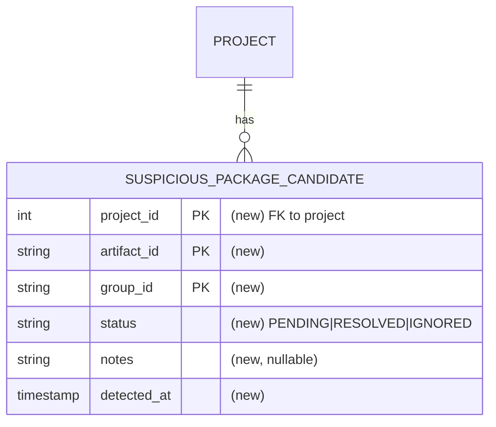

# Spec: Suspicious package candidate collection

## 1. Goal
Find cases where the same `artifactId` is published under more than one `groupId` within a single indexed project, and store each one in a table a reviewer can work through. A scheduled job recomputes the conflict set on a fixed cadence and records each new entry as pending; the reviewer supplies the decision (`status`) and the reasoning (`notes`), and the job never touches either again. This task detects and collects the cases only; it makes no ban or verdict decision.

## 2. Problem
klibs.io needs a way to ban packages that impersonate a real library: the same artifact republished under a different `groupId` while pointing at the original project's repository (KTL-4151). Before anything can be banned, the candidate cases have to be collected somewhere — which `(artifactId, groupId)` entries conflict within a project, and the outcome once a reviewer handles them. Nothing collects or stores this today. This task builds that collection step and produces the input the ban work will draw on.

Affected: klibs.io maintainers reviewing possible impersonation, and the later ban pipeline that consumes the reviewed cases.

## 3. User scenarios & acceptance

### Scenario 1 — Conflicting entries are detected and collected (P1)
- **Given:** the catalogue contains a project where one `artifactId` is published under two or more distinct `groupId`s.
- **When:** the collection job runs.
- **Then:** one row per `(project_id, artifact_id, group_id)` entry exists in the candidate table, each with `status = PENDING` and a `detected_at` timestamp.
- **Independent test:** a DB-integration test seeds `package` rows forming a conflict, runs the recompute, and asserts the entry rows exist with `PENDING`.

### Scenario 2 — Reviewer decisions survive re-runs (P1)
- **Given:** a reviewer has set a candidate row to `RESOLVED` or `IGNORED`.
- **When:** the collection job runs again while the entry still conflicts.
- **Then:** the row is untouched — `status` is not reset to `PENDING`, `notes` is not cleared, and no duplicate row is created.
- **Independent test:** a DB-integration test marks a row `RESOLVED`, re-runs the recompute, and asserts the status is still `RESOLVED` with exactly one row for that key.

### Edge cases
- An entry can stop conflicting on a later run only if packages are removed — its own, or enough of its siblings' that the `artifactId` is left under a single `groupId`. Indexing never deletes packages (it only inserts new versions or updates existing rows) and a package's `group_id` never changes; the only deletion path is the admin ban flow (`DELETE FROM package`). So banning one entry can drop its siblings out of detection too. Rows are kept as they are, with their last `status` and `notes`, as an audit record; collection never deletes rows that drop out of detection.
- The entries of a conflict are indexed at different times, so the conflict is recorded on the first scheduled run after at least two of its entries exist in `package`. No backfill is needed: the first run seeds every conflict already present in the catalogue.
- A missed or failed run costs only a later `detected_at`, because the next run re-derives the whole set and inserts what is missing.

## 4. Functional requirements
- **FR-001:** For every `(project_id, artifact_id)` where that `artifactId` is published under more than one distinct `groupId` within the project, the system MUST record one row per `(project_id, artifact_id, group_id)` entry.
- **FR-002:** Each row MUST persist its full coordinate (`project_id`, `artifact_id`, `group_id`) as readable columns, so a reviewer can identify an entry and pull every entry that shares its `(project_id, artifact_id)` group.
- **FR-003:** Each entry within one conflict MUST hold an independent `status` and `notes`. Setting one entry's `status` MUST NOT change a sibling entry's `status` or `notes`.
- **FR-004:** For every `(project_id, artifact_id)` conflict, the system MUST record all of its entries; it MUST NOT pre-filter candidates by any signal (dormancy, owner mismatch, etc.). Triage is manual.
- **FR-005:** The system MUST provide a nullable free-text `notes` field for reviewers to record why a row was moved to `RESOLVED` or `IGNORED`. The collection job populates the table but MUST NOT write or overwrite `notes`.
- **FR-006:** A newly detected entry MUST be recorded with `status = PENDING` and a `detected_at` timestamp.
- **FR-007:** `status` MUST be one of `PENDING`, `RESOLVED`, `IGNORED`, meaning: `PENDING` — nobody has looked at this entry yet; `RESOLVED` — a reviewer looked and reached a determination, either to ban the entry or to keep it; `IGNORED` — a reviewer looked, found no conclusive evidence either way, and the entry is therefore kept. Both mean the entry has been reviewed. Only `RESOLVED` can lead to a ban: an inconclusive review leaves the entry in place, which is the safe default.
- **FR-008:** A reviewer-set `status` and `notes` MUST persist across subsequent collection runs; a re-run MUST NOT revert a `RESOLVED` or `IGNORED` row to `PENDING` or clear its `notes`.
- **FR-009:** A collection run MUST NOT create duplicate rows for the same `(project_id, artifact_id, group_id)` entry.
- **FR-010:** When a previously recorded entry is no longer detected as conflicting, the system MUST keep its existing row unchanged; it MUST NOT delete rows that drop out of detection.
- **FR-011:** The system MUST NOT record an entry whose `(project_id, artifact_id)` is published under a single `groupId`, however many versions that entry has. Detection counts distinct `groupId`s, never `package` rows.

## 5. Non-functional requirements
- **Performance and dataset size:** the output is small. Measured against a production copy (data through 2026-06-22): 2,132 conflicting entry rows over 1,034 `(project_id, artifact_id)` conflicts across 219 projects. Detection is a single set-based query over `package` (filtered `project_id IS NOT NULL`) run on a schedule: it aggregates per `(project_id, artifact_id, group_id)` and keeps only the entries whose `(project_id, artifact_id)` spans more than one `group_id`. Measured at 0.11s on that copy with a warm cache: a sequential scan of the 551,881 `package` rows, hash-aggregated to 14,201 distinct `(project_id, artifact_id, group_id)` triples, then sorted and window-aggregated. Allow more on a cold cache. The indexing pipeline is not touched, so no per-package cost is added. Worth knowing about the queue's composition: 477 of those 1,034 conflicts come from `com.sonatype.central.testing.*`, Sonatype republishing `aws-sdk-kotlin` and `smithy-kotlin` while exercising Maven Central, so roughly half the initial queue is that one publisher.
- **External rate limits:** none. Detection reads only the local `package` table; the remaining columns are a constant `status`, a clock `detected_at`, and reviewer-authored `notes`. No GitHub, Maven Central, or OpenAI calls.
- **Concurrency:** detection is a standalone scheduled job under its own `@SchedulerLock` (ShedLock), so only one instance runs it. The write is insert-only and idempotent on the `(project_id, artifact_id, group_id)` key (FR-008, FR-009), so any re-run, scheduled or manual, never duplicates or resets a row. It shares the single-threaded scheduler with every other `@Scheduled` job, so a daily sub-second aggregation keeps its footprint on that thread small (see §13).
- **Observability:** each run logs a summary (rows inserted, total candidates). The first run's insert count can be checked against the 2,132-row baseline above to confirm the seed worked.

## 6. Out of scope
- Any verdict or classification (impersonation vs. namespace migration, monorepo, transfer, relocation, fork) and any ban action.
- GitHub API ownership or fork verification. Verification and the decision come later.
- Storing any signal recomputable from the coordinate — version count, first and last release, an owner parsed from the `groupId`. A reviewer queries `package` for these when needed.
- Any pre-filtering, ranking, or exclusion list for publishers that are never real conflicts. FR-004 records every conflicting entry; the reviewer applies judgement.
- Any reviewer UI or API endpoint. The table is populated only.
- Auto-correlation with `banned_packages`. When an entry is banned its `package` rows are deleted, so it drops out of detection and its row is kept as-is (FR-010); marking such rows automatically by cross-referencing `banned_packages` is out of scope.
- Repo rename or transfer normalization, already handled upstream by indexing: `scm_repo.id_native` is unique and a repo is resolved by GitHub `nativeId`, so a renamed or transferred repo dedups back to the same `scm_repo` instead of creating a second project. Covered by `GitHubIndexingServiceUpdateRepoTest` (`repository renamed under same owner …`, `owner changed but same nativeId …`).

## 7. Klibs.io technical surface
- **Modules touched:** `core/package` gets a new candidate `@Entity`, its `@IdClass`, and a Spring Data repository holding the collection statement. This is the JPA module that owns the `package` table the statement scans. `app` gets one new scheduled job class, modelled on `RefreshDependentCountJob`, that calls the repository. No collector service: the collection body is a single statement, so the job calls the repository directly. The indexing pipeline is not modified.
- **Database:** one additive migration in `db/migration/2026-Q3/`, registered in `db.changelog-master.yml`. The table ships empty and is populated by the job; its first run seeds all pre-existing conflicts.
  1. Candidate table (working name `suspicious_package_candidate`). Fields: `project_id` (FK to `project`, `ON DELETE NO ACTION` as `fk_package_project_id` already does, so a reviewer's record can never be cascaded away; `project_tags` uses `CASCADE`, which would contradict FR-010); `artifact_id`; `group_id`; `status` (`PENDING`/`RESOLVED`/`IGNORED`); `notes` (nullable, reviewer-authored); `detected_at`. Identity is the natural key `(project_id, artifact_id, group_id)` — no surrogate id and no sequence. Group key `(project_id, artifact_id)`. Exact column types and index choices are plan-level.
- **Persistence style:** JPA, per CLAUDE.md ("JPA-first, avoid JDBC in new code"). The candidate table is a `@Entity` with an `@IdClass` composite identifier and a Spring Data repository; `project_id` is a plain column with the FK enforced in the migration, not a JPA `@ManyToOne`, so the entity adds no `core/package` → `core/project` dependency. Collection is a single `@Modifying @Query`, following `MavenArtifactRepository.saveIfAbsent` in this same module, which already writes `INSERT … ON CONFLICT … DO NOTHING` as HQL rather than native SQL — Hibernate has supported the `on conflict` clause since 6.5, and this project is on 7.2.7. Every in-repo precedent is `INSERT … VALUES`, so whether the insert-select form also parses as HQL or needs `nativeQuery = true` is a plan-level question to settle when the statement is written. The 7.2.7 HQL grammar carries the conflict clause on the insert statement itself, whether the source is a values list or a query expression, so the likelier obstacle is the two-level `SELECT` (§13) rather than the conflict clause. Either way it stays inside the Spring Data repository and is not JDBC.
- **Search and materialized views:** none. Independent of `project_index` and `package_index`.
- **External integrations:** none.
- **Scheduled jobs:** one new recurring job, a periodic full recompute modelled on `RefreshDependentCountJob` (`@Scheduled(fixedRate = …)`, `@SchedulerLock`, `@ConditionalOnProperty`). Cadence is daily (`fixedRate = 1, timeUnit = DAYS`), because the conflict set changes slowly and a review queue does not need sub-day freshness; nothing acts on a conflict automatically, so a missed run costs only a later `detected_at`, and the cadence is a one-line change if it needs tuning. No backfill mechanism is needed: the first run seeds every conflict already in `package`.
- **Storage:** none.
- **Configuration:** none new. The job reuses the existing `klibs.indexing` toggle via `@ConditionalOnProperty`, as every other pipeline job does. Collection is meaningless where indexing is off, and a new key would have to be added to `application.yml` and to the prod environment or `@ConditionalOnProperty` would leave the bean unregistered and the job would silently never run.
- **API surface:** none.
- **Frontend contract:** none.

## 8. Design decisions

### Decision — One row per entry, not one row per conflict
- **Choice:** the grain stays `(project_id, artifact_id, group_id)`. A conflict spanning four `groupId`s is four rows, not one row holding a list of four.
- **Why:** the review outcome is per-entry, not per-conflict. KTL-4618's verdicts include conflicts where a reviewer bans some entries and keeps others, so within one conflict the reason recorded differs per entry, and so does the coordinate handed to `banned_packages`. One row per conflict could hold neither without flattening several different reasons into a single `notes` field. Per-entry rows also make a `groupId` joining an existing conflict a plain insert (FR-001, FR-006), arriving `PENDING` alongside siblings already `RESOLVED` (FR-008), rather than a rewrite of a row that already holds a decision.
- **Rejected:** one row per `(project_id, artifact_id)` with the `groupId`s in an array. Half the rows, and it reads well when a whole conflict is judged at once, but it needs a second parallel array to say which entries were which, with nothing keeping the two in sync, and no place for a per-entry `detected_at` or `notes`.

### Decision — Collection is one insert-only statement
- **Choice:** the collection body is `INSERT INTO … SELECT … ON CONFLICT (project_id, artifact_id, group_id) DO NOTHING`. Detection is the `SELECT`, over `package` filtered `project_id IS NOT NULL`.
- **Why:** the job only ever creates rows and a reviewer only ever updates them, so FR-008, FR-009 and FR-010 become impossible to violate rather than rules the code must honour — there is no code path that writes an existing row. Nothing is read into memory: no `findAll`, no in-memory merge, no `saveAll` — the statement runs entirely in the database. `ON CONFLICT … DO NOTHING` is already the idiom in this module, in `MavenArtifactRepository.saveIfAbsent`.
- **Rejected:** an upsert that refreshes the row on each run, which needs to read the existing rows first and reintroduces the possibility of overwriting a reviewer's decision.

### Decision — Identity is the natural key
- **Choice:** the primary key is `(project_id, artifact_id, group_id)`, mapped with `@IdClass`. No surrogate id, no sequence.
- **Why:** the natural key already identifies a row uniquely, so a surrogate adds a column, a sequence and a generation strategy for nothing. `@IdClass` over a composite natural key is the idiom in `TagEntity` and `Marker`.
- **Rejected:** a `bigint` identity PK plus a unique constraint on the natural key — two identities for one row.

### Decision — Detection is a standalone periodic recompute job
- **Choice:** detection runs as its own scheduled job that recomputes the full conflict set and inserts what is missing. The indexing pipeline is left alone. There is no one-time backfill and no per-package hook: the first run seeds all pre-existing conflicts, and every later run re-derives the full set.
- **Why:** every run recomputes from `package`, so a transient failure, a skipped run or a deploy gap is corrected on the next one, and because the write is insert-only the only cost of a miss is a later `detected_at`. It keeps the indexing path untouched, needs no backfill runner, and mirrors `RefreshDependentCountJob`, an accepted periodic full-recompute on the same single-threaded scheduler with a heavier workload and a tighter cadence.
- **Rejected — an inline per-package hook plus a one-time backfill:** it catches a conflict as soon as its second package commits, but edits the indexing path and takes on transaction-boundary risk, and in its post-commit form a swallowed error or a crash between commit and hook is never retried, so the candidate is missed until something in the conflict is reindexed.
- **Rejected — a tail-of-drain step:** it conflates "queue drained" with "data complete". The drain is priority-ordered and can run well past its 4h lock under a backlog.

## 9. Key entities (only if data model changes)
- **`SuspiciousPackageCandidate`** (working name): one row per entry of a conflict.
  - **Key fields:** `projectId`, `artifactId`, `groupId` (together the `@IdClass` identity); `status` (`PENDING`/`RESOLVED`/`IGNORED`); `notes` (nullable, reviewer-authored); `detectedAt`.
  - **Relationships:** many candidates per `project`; group key `(projectId, artifactId)`.
  - **Lifecycle:** created `PENDING` by the job, and never written by it again. A reviewer moves it to `RESOLVED` once they can say whether the entry should be banned or kept, or to `IGNORED` when there is no conclusive evidence either way and the entry is therefore kept, and may add `notes`. Kept indefinitely, including after it stops conflicting.

## 10. Database schema diagram (only if schema changes)

## 11. Test strategy
- **Unit:** none. The collection body is a single SQL statement, so its behaviour is only observable against a database.
- **DB-integration (`BaseUnitWithDbLayerTest`, in `app/src/test` — the base class boots `io.klibs.app.Application`, and no `core` module holds DB tests):** method-level `@Sql` seeds build conflicts; run the recompute and assert Scenario 1 (all entries recorded `PENDING`) and Scenario 2 (a second run preserves a reviewer's `RESOLVED` status and `notes`, with no duplicates). Also assert a `groupId` joining an already-reviewed conflict arrives `PENDING` while its siblings stay untouched, two entries of one conflict hold independent `status` and `notes` (FR-003), the recompute ignores a single-`groupId` artifact **that has several versions** and still records a conflict entry that has **only one version** (FR-011; a flat count over `package` rows fails in both directions), skips `project_id IS NULL` packages, records every entry of a conflict spanning three or more `groupId`s, and that a first run against a pre-seeded catalogue produces the expected rows (the "no backfill needed" property). For FR-010, remove one entry's `package` rows from a two-entry conflict and assert **both** rows survive unchanged — the removed entry's, and its sibling's, which also drops out of detection once it is the only `groupId` left.
- **Web and smoke:** none, since there is no endpoint.
- *Reviewer-only, manual on staging:* run the job against a production DB copy, confirm the first-run insert count matches the 2,132-row baseline, then hand-edit a status and confirm it survives the next run.

## 12. Assumptions
- **Detection semantics:** a `(project_id, artifact_id)` conflicts when it spans more than one distinct `group_id`, and one entry row is recorded per `(project_id, artifact_id, group_id)`.
- **Detection is recompute-based:** each scheduled run recomputes the full conflict set from `package`. A conflict appears on the first run after its entries are committed. No backfill is needed, since the first run seeds pre-existing conflicts, and a missed or failed run is corrected on the next one because every run re-derives the whole set.
- **`package` holds one row per version:** the table carries a unique `(group_id, artifact_id, version)` (`package_group_id_artifact_id_version_key`, confirmed in the live schema), with `version` and `release_ts` NOT NULL. Counting `package` rows therefore counts versions, which is why detection must count distinct `group_id`s (FR-011).
- **`package.project_id` is nullable:** a package with no resolved GitHub repo has no project, so detection filters `project_id IS NOT NULL`. An intra-project conflict requires a project.
- **Projects sharing an `scm_repo` do not produce false conflicts.** Several manually created projects can point at one repo — 22 androidx projects share `scm_repo` 902585. Detection keys on `project_id`, not `scm_repo_id`, so packages in two projects that share a repo can never conflict with each other. Checked against the production copy: zero conflicts across those 22 projects.
- **Indexing never deletes packages** (verified in code): the pipeline only inserts new package-versions or updates existing rows (reindex, description and version-type backfill), and a package's `group_id` never changes. The only path that removes `package` rows is the admin ban flow (`BlacklistService`, `DELETE FROM package`), which also excludes the coordinate from re-indexing through a `banned_packages` `NOT EXISTS` filter. So detection loses an entry only as a consequence of a ban — either the entry's own, or a sibling's that leaves the `artifactId` under one `groupId`. That is why rows are kept as an audit record (FR-010).
- **Banned coordinates never surface as candidates:** their `package` rows are deleted on ban and never re-indexed, so a scan over `package` cannot produce a candidate for them.
- **A reviewer's signals are recomputable at read time:** version count, first and last release, and an owner parsed from the `groupId` are all a query over `package` away, so none of them need to be stored. This holds only while every signal is local; the ownership check in KTL-4151 will not be.
- No external API is needed to populate any column.
- Prod scale: 2,132 conflicting entry rows over 1,034 `(project_id, artifact_id)` conflicts across 219 projects, measured on a copy with data through 2026-06-22. Each run scans `package` (551,881 rows) as one set-based aggregation, measured at 0.11s warm; it runs daily.

## 13. References
- **Job precedent (in-repo):** `app/src/main/kotlin/io/klibs/app/job/RefreshDependentCountJob.kt` — `@Scheduled(fixedRate = 6, HOURS)`, `@SchedulerLock(lockAtMostFor = "1h")`, gated on `klibs.indexing`. A catalogue-wide periodic recompute; this job mirrors it at a lighter daily cadence.
- **Scheduling and single-thread config (in-repo):** `app/src/main/kotlin/io/klibs/app/configuration/SchedulingConfiguration.kt` — `@EnableScheduling` with no `TaskScheduler` bean, so one thread is shared by all `@Scheduled` methods, and `@EnableSchedulerLock(defaultLockAtMostFor = "10m")` applies unless the job sets its own. That thread is already held for hours by `ProcessPackageIndexRequestJob` (queue drain, `fixedRate = 4h`, `lockAtMostFor = 4h`) and `IndexNewPackagesJob` (`cron 0 0 2 * * *`, `lockAtMostFor = 23h`); the frequent light jobs (GitHub owner and repo 30s, AI description 1m and tags 65s, materialized-view refresh 10m) already yield to those. A daily sub-second aggregation is small next to that load.
- **In-repo idioms:** `TagEntity` and `Marker` for `@IdClass` over a natural key; `MavenArtifactRepository.saveIfAbsent` (same module) for `INSERT … ON CONFLICT … DO NOTHING` written as HQL; `PackageRepository.findDuplicateDescriptions` for the `GROUP BY … HAVING COUNT(*) > 1` idiom — but note it returns the group keys that have duplicates, while detection needs the members of qualifying groups. The statement is therefore two-level: reduce `package` to distinct `(project_id, artifact_id, group_id)` triples, then keep those whose `(project_id, artifact_id)` holds more than one — either by joining back to `… GROUP BY project_id, artifact_id HAVING COUNT(DISTINCT group_id) > 1`, or with `COUNT(*) OVER (PARTITION BY project_id, artifact_id) > 1` over the distinct triples. Both forms were checked against Postgres 17. A flat `GROUP BY project_id, artifact_id, group_id HAVING COUNT(*) > 1` counts versions instead and is wrong in both directions: it records a single-`groupId` artifact that merely has several versions, and misses a conflict entry published only once. Note `COUNT(DISTINCT …)` is valid in `HAVING` but not as a window function — Postgres rejects `COUNT(DISTINCT …) OVER (…)`.
- **Native aggregation precedent (in-repo, same module):** `PackageRepository.findAllKnownMavenCentralPackages` — `nativeQuery = true` with `GROUP BY` and `ARRAY_AGG` into a `PackageVersionsView` interface projection. The pattern to fall back to if the insert-select will not parse as HQL.
- **Ban flow (in-repo):** `BlacklistService` and `BlacklistRepositoryJdbc` (`DELETE FROM package`); `IndexingRequestRepository.findFirstForIndexing` (the `banned_packages` `NOT EXISTS` filter); table `banned_packages` (`db/migration/2025-Q1/2025-03-21_add_banned_packages_table.yml`).
- **Tickets:** KTL-4790 (this task, collect potential cases in the table), which supports KTL-4151 (ban packages linked to the original repository) and builds on KTL-4617 (detection) and KTL-4618 (verdicts).
